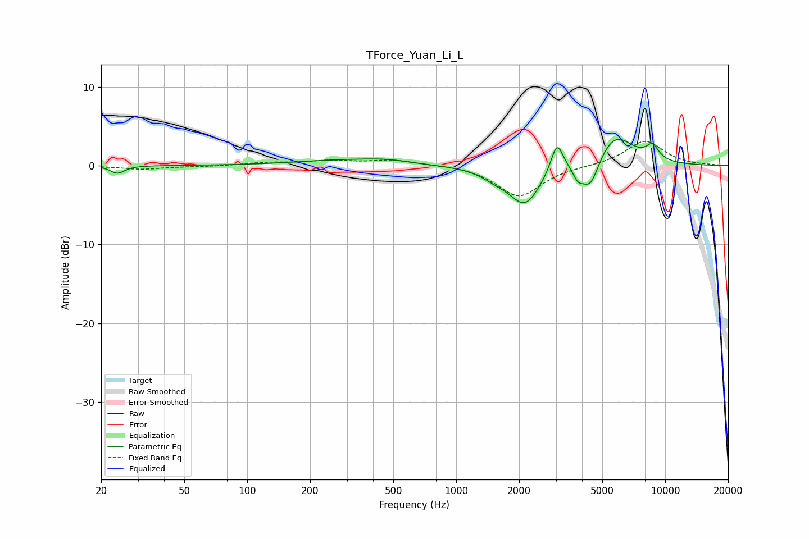

# TForce_Yuan_Li_L
See [usage instructions](https://github.com/jaakkopasanen/AutoEq#usage) for more options and info.

### Parametric EQs
Apply preamp of -3.4 dB when using parametric equalizer.

|   # | Type    |   Fc (Hz) |    Q |   Gain (dB) |
|-----|---------|-----------|------|-------------|
|   1 | Peaking |        24 | 4.39 |        -1   |
|   2 | Peaking |       292 | 0.62 |         0.7 |
|   3 | Peaking |       464 | 1.36 |         0.4 |
|   4 | Peaking |      1546 | 1.97 |        -0.9 |
|   5 | Peaking |      2136 | 1.89 |        -4.8 |
|   6 | Peaking |      3036 | 4.71 |         3.9 |
|   7 | Peaking |      3827 | 5.98 |        -1.4 |
|   8 | Peaking |      4379 | 3.35 |        -3.8 |
|   9 | Peaking |      5745 | 1.55 |         4.1 |
|  10 | Peaking |      8685 | 4.15 |         1.8 |

### Fixed Band EQs
When using fixed band (also called graphic) equalizer, apply preamp of **-3.2 dB** (if available) and set gains manually with these parameters.

|   # | Type    |   Fc (Hz) |    Q |   Gain (dB) |
|-----|---------|-----------|------|-------------|
|   1 | Peaking |        31 | 1.41 |        -0.4 |
|   2 | Peaking |        62 | 1.41 |        -0.1 |
|   3 | Peaking |       125 | 1.41 |         0.3 |
|   4 | Peaking |       250 | 1.41 |         0.5 |
|   5 | Peaking |       500 | 1.41 |         0.7 |
|   6 | Peaking |      1000 | 1.41 |         0.2 |
|   7 | Peaking |      2000 | 1.41 |        -4   |
|   8 | Peaking |      4000 | 1.41 |        -0   |
|   9 | Peaking |      8000 | 1.41 |         3.2 |
|  10 | Peaking |     16000 | 1.41 |         0.1 |

### Graphs

