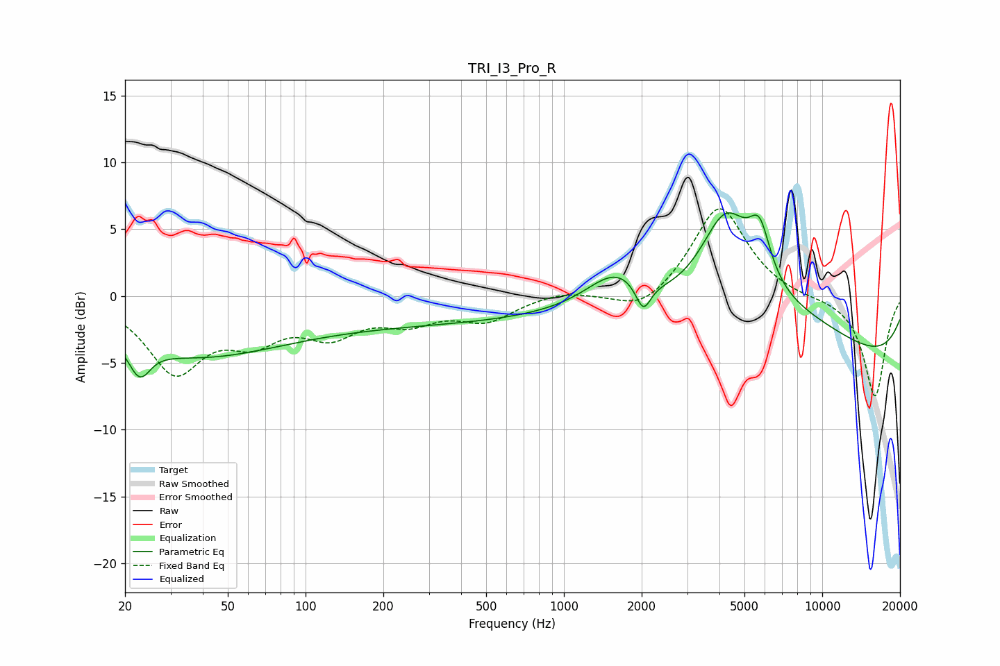

# TRI_I3_Pro_R
See [usage instructions](https://github.com/jaakkopasanen/AutoEq#usage) for more options and info.

### Parametric EQs
Apply preamp of -6.3 dB when using parametric equalizer.

|   # | Type    |   Fc (Hz) |    Q |   Gain (dB) |
|-----|---------|-----------|------|-------------|
|   1 | Peaking |        23 | 4.5  |        -5.3 |
|   2 | Peaking |        23 | 5.39 |         2.9 |
|   3 | Peaking |        36 | 0.41 |        -4.1 |
|   4 | Peaking |       283 | 0.27 |        -1.9 |
|   5 | Peaking |      1598 | 1.2  |         3   |
|   6 | Peaking |      2028 | 4.79 |        -2.2 |
|   7 | Peaking |      4233 | 1.35 |         7.6 |
|   8 | Peaking |      5725 | 3.31 |         3.7 |
|   9 | Peaking |      7245 | 0.44 |         3.3 |
|  10 | Peaking |      9786 | 0.18 |        -5.7 |

### Fixed Band EQs
When using fixed band (also called graphic) equalizer, apply preamp of **-6.6 dB** (if available) and set gains manually with these parameters.

|   # | Type    |   Fc (Hz) |    Q |   Gain (dB) |
|-----|---------|-----------|------|-------------|
|   1 | Peaking |        31 | 1.41 |        -5.4 |
|   2 | Peaking |        62 | 1.41 |        -2.6 |
|   3 | Peaking |       125 | 1.41 |        -2.5 |
|   4 | Peaking |       250 | 1.41 |        -1.6 |
|   5 | Peaking |       500 | 1.41 |        -1.7 |
|   6 | Peaking |      1000 | 1.41 |         0.4 |
|   7 | Peaking |      2000 | 1.41 |        -1.4 |
|   8 | Peaking |      4000 | 1.41 |         6.9 |
|   9 | Peaking |      8000 | 1.41 |        -0.2 |
|  10 | Peaking |     16000 | 1.41 |        -7.6 |

### Graphs

