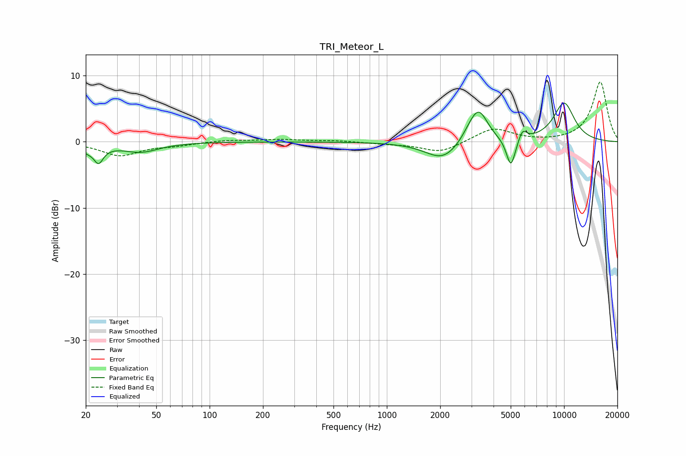

# TRI_Meteor_L
See [usage instructions](https://github.com/jaakkopasanen/AutoEq#usage) for more options and info.

### Parametric EQs
Apply preamp of -5.9 dB when using parametric equalizer.

|   # | Type    |   Fc (Hz) |    Q |   Gain (dB) |
|-----|---------|-----------|------|-------------|
|   1 | Peaking |        21 | 2.35 |        -1.7 |
|   2 | Peaking |        23 | 3.47 |         0.9 |
|   3 | Peaking |        24 | 5.61 |        -2.3 |
|   4 | Peaking |        41 | 1.4  |        -1.4 |
|   5 | Peaking |      2078 | 1.44 |        -2.9 |
|   6 | Peaking |      2987 | 2.63 |         1.6 |
|   7 | Peaking |      3324 | 2.76 |         4.2 |
|   8 | Peaking |      5012 | 5.45 |        -4.4 |
|   9 | Peaking |      5836 | 6    |         1.6 |
|  10 | Peaking |     10000 | 1.97 |         5.8 |

### Fixed Band EQs
When using fixed band (also called graphic) equalizer, apply preamp of **-9.1 dB** (if available) and set gains manually with these parameters.

|   # | Type    |   Fc (Hz) |    Q |   Gain (dB) |
|-----|---------|-----------|------|-------------|
|   1 | Peaking |        31 | 1.41 |        -2   |
|   2 | Peaking |        62 | 1.41 |        -0.5 |
|   3 | Peaking |       125 | 1.41 |         0.3 |
|   4 | Peaking |       250 | 1.41 |         0.3 |
|   5 | Peaking |       500 | 1.41 |         0.2 |
|   6 | Peaking |      1000 | 1.41 |        -0.3 |
|   7 | Peaking |      2000 | 1.41 |        -1.6 |
|   8 | Peaking |      4000 | 1.41 |         2.1 |
|   9 | Peaking |      8000 | 1.41 |        -0.1 |
|  10 | Peaking |     16000 | 1.41 |         9.1 |

### Graphs

