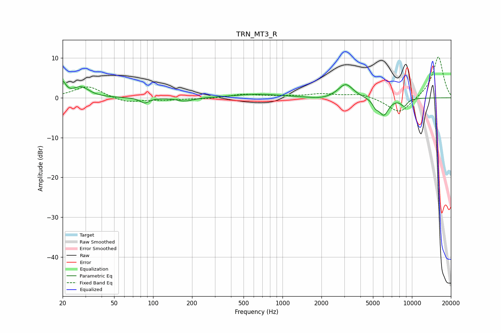

# TRN_MT3_R
See [usage instructions](https://github.com/jaakkopasanen/AutoEq#usage) for more options and info.

### Parametric EQs
Apply preamp of -4.2 dB when using parametric equalizer.

|   # | Type    |   Fc (Hz) |    Q |   Gain (dB) |
|-----|---------|-----------|------|-------------|
|   1 | Peaking |        20 | 5.75 |         3.3 |
|   2 | Peaking |        28 | 2.31 |         2.6 |
|   3 | Peaking |        86 | 4.14 |        -1.3 |
|   4 | Peaking |       177 | 2.27 |        -0.9 |
|   5 | Peaking |       642 | 0.8  |         0.9 |
|   6 | Peaking |      2012 | 1.71 |        -0.5 |
|   7 | Peaking |      3076 | 2.46 |         3.6 |
|   8 | Peaking |      5231 | 5.98 |        -1.5 |
|   9 | Peaking |      6060 | 3.59 |        -4.2 |
|  10 | Peaking |      8711 | 5.02 |        -1.8 |

### Fixed Band EQs
When using fixed band (also called graphic) equalizer, apply preamp of **-10.4 dB** (if available) and set gains manually with these parameters.

|   # | Type    |   Fc (Hz) |    Q |   Gain (dB) |
|-----|---------|-----------|------|-------------|
|   1 | Peaking |        31 | 1.41 |         3   |
|   2 | Peaking |        62 | 1.41 |        -1.3 |
|   3 | Peaking |       125 | 1.41 |        -0.5 |
|   4 | Peaking |       250 | 1.41 |        -0.3 |
|   5 | Peaking |       500 | 1.41 |         0.9 |
|   6 | Peaking |      1000 | 1.41 |         0.3 |
|   7 | Peaking |      2000 | 1.41 |         0.9 |
|   8 | Peaking |      4000 | 1.41 |         1   |
|   9 | Peaking |      8000 | 1.41 |        -4.1 |
|  10 | Peaking |     16000 | 1.41 |        10.5 |

### Graphs

