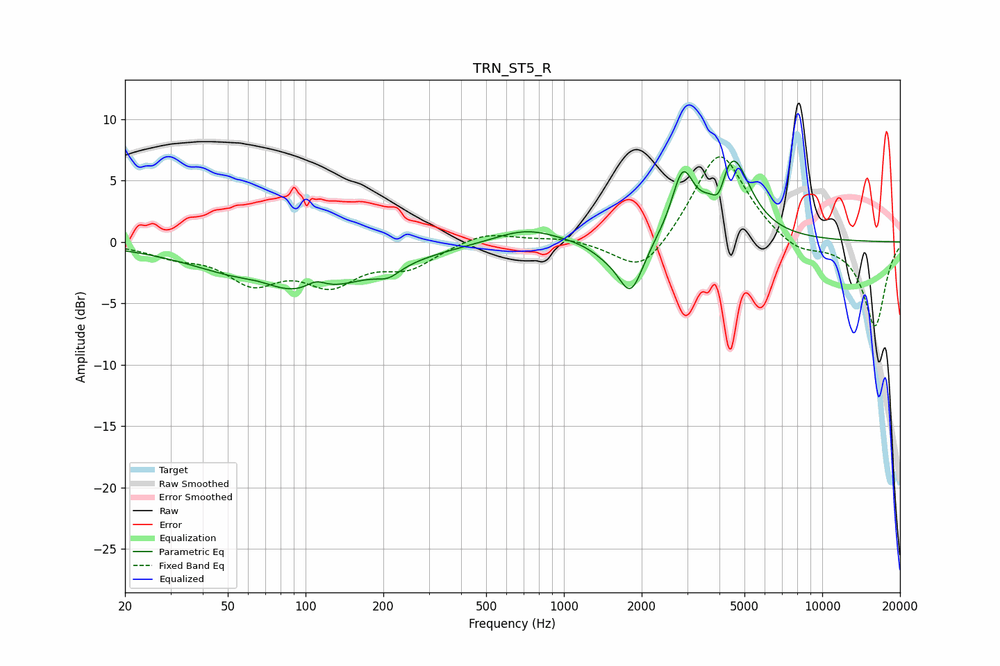

# TRN_ST5_R
See [usage instructions](https://github.com/jaakkopasanen/AutoEq#usage) for more options and info.

### Parametric EQs
Apply preamp of -6.7 dB when using parametric equalizer.

|   # | Type    |   Fc (Hz) |    Q |   Gain (dB) |
|-----|---------|-----------|------|-------------|
|   1 | Peaking |        66 | 1.75 |         0.6 |
|   2 | Peaking |        91 | 0.51 |        -4.3 |
|   3 | Peaking |       110 | 3.65 |         0.8 |
|   4 | Peaking |       209 | 3.07 |        -0.8 |
|   5 | Peaking |       712 | 1.15 |         1.2 |
|   6 | Peaking |      1447 | 2.25 |        -0.7 |
|   7 | Peaking |      1815 | 2.84 |        -4.3 |
|   8 | Peaking |      2881 | 3.4  |         4.8 |
|   9 | Peaking |      3983 | 5.56 |        -1.9 |
|  10 | Peaking |      4475 | 2.05 |         6.9 |

### Fixed Band EQs
When using fixed band (also called graphic) equalizer, apply preamp of **-7.0 dB** (if available) and set gains manually with these parameters.

|   # | Type    |   Fc (Hz) |    Q |   Gain (dB) |
|-----|---------|-----------|------|-------------|
|   1 | Peaking |        31 | 1.41 |        -0.9 |
|   2 | Peaking |        62 | 1.41 |        -3   |
|   3 | Peaking |       125 | 1.41 |        -3   |
|   4 | Peaking |       250 | 1.41 |        -1.8 |
|   5 | Peaking |       500 | 1.41 |         0.9 |
|   6 | Peaking |      1000 | 1.41 |         0.4 |
|   7 | Peaking |      2000 | 1.41 |        -3   |
|   8 | Peaking |      4000 | 1.41 |         7.7 |
|   9 | Peaking |      8000 | 1.41 |        -1.1 |
|  10 | Peaking |     16000 | 1.41 |        -6.9 |

### Graphs

