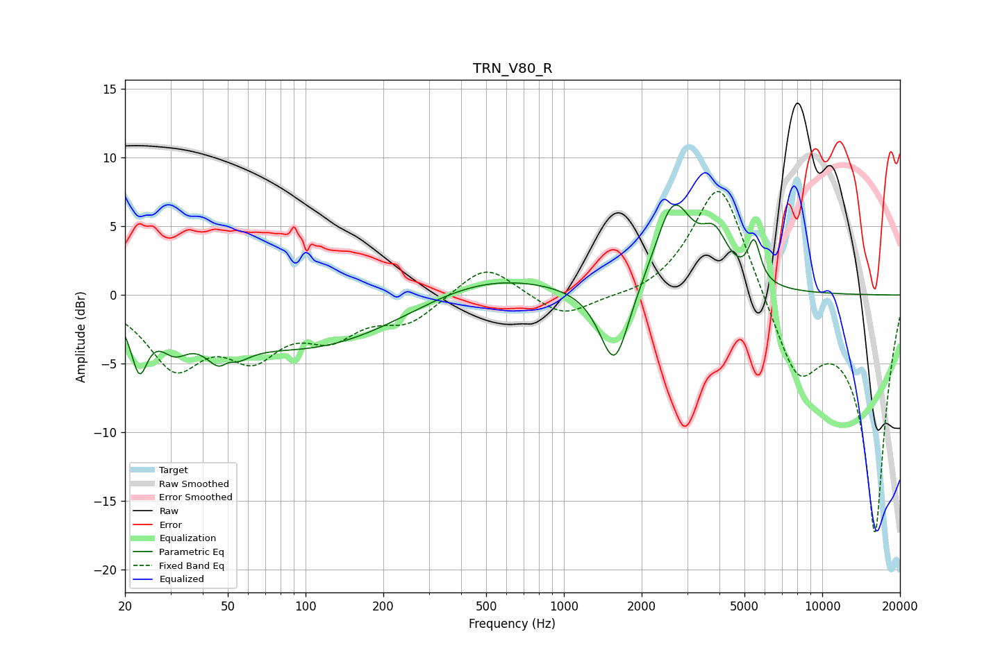

# TRN_V80_R
See [usage instructions](https://github.com/jaakkopasanen/AutoEq#usage) for more options and info.

### Parametric EQs
Apply preamp of -6.7 dB when using parametric equalizer.

|   # | Type    |   Fc (Hz) |    Q |   Gain (dB) |
|-----|---------|-----------|------|-------------|
|   1 | Peaking |        23 | 4.51 |        -4   |
|   2 | Peaking |        31 | 2.59 |        -1.9 |
|   3 | Peaking |        49 | 2.7  |        -4.6 |
|   4 | Peaking |        50 | 3.92 |         2.7 |
|   5 | Peaking |       105 | 0.37 |        -4   |
|   6 | Peaking |       472 | 0.52 |         1.9 |
|   7 | Peaking |      1571 | 2.46 |        -6.1 |
|   8 | Peaking |      2653 | 1.94 |         6.5 |
|   9 | Peaking |      3834 | 2.66 |         3.1 |
|  10 | Peaking |      5451 | 5.91 |         2.9 |

### Fixed Band EQs
When using fixed band (also called graphic) equalizer, apply preamp of **-7.6 dB** (if available) and set gains manually with these parameters.

|   # | Type    |   Fc (Hz) |    Q |   Gain (dB) |
|-----|---------|-----------|------|-------------|
|   1 | Peaking |        31 | 1.41 |        -4.9 |
|   2 | Peaking |        62 | 1.41 |        -3.7 |
|   3 | Peaking |       125 | 1.41 |        -2.5 |
|   4 | Peaking |       250 | 1.41 |        -1.8 |
|   5 | Peaking |       500 | 1.41 |         2.4 |
|   6 | Peaking |      1000 | 1.41 |        -1.7 |
|   7 | Peaking |      2000 | 1.41 |        -0.3 |
|   8 | Peaking |      4000 | 1.41 |         8.8 |
|   9 | Peaking |      8000 | 1.41 |        -5.7 |
|  10 | Peaking |     16000 | 1.41 |       -17.2 |

### Graphs

