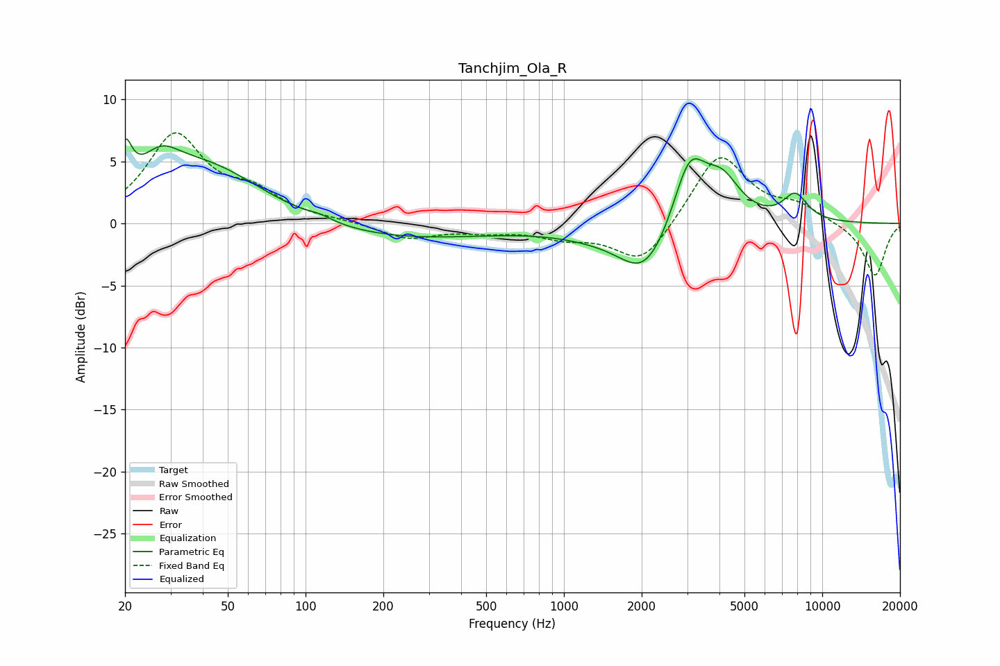

# Tanchjim_Ola_R
See [usage instructions](https://github.com/jaakkopasanen/AutoEq#usage) for more options and info.

### Parametric EQs
Apply preamp of -6.9 dB when using parametric equalizer.

|   # | Type    |   Fc (Hz) |    Q |   Gain (dB) |
|-----|---------|-----------|------|-------------|
|   1 | Peaking |        20 | 5.51 |         3.4 |
|   2 | Peaking |        27 | 2.02 |         2.1 |
|   3 | Peaking |        40 | 0.54 |         6.1 |
|   4 | Peaking |        94 | 0.18 |        -1.8 |
|   5 | Peaking |       114 | 2.88 |         0.3 |
|   6 | Peaking |      1274 | 0.91 |        -0.5 |
|   7 | Peaking |      2069 | 1.37 |        -4.2 |
|   8 | Peaking |      3066 | 2.17 |         5.7 |
|   9 | Peaking |      4103 | 2    |         3.1 |
|  10 | Peaking |      7866 | 2.78 |         2.1 |

### Fixed Band EQs
When using fixed band (also called graphic) equalizer, apply preamp of **-7.4 dB** (if available) and set gains manually with these parameters.

|   # | Type    |   Fc (Hz) |    Q |   Gain (dB) |
|-----|---------|-----------|------|-------------|
|   1 | Peaking |        31 | 1.41 |         6.9 |
|   2 | Peaking |        62 | 1.41 |         2   |
|   3 | Peaking |       125 | 1.41 |         0.2 |
|   4 | Peaking |       250 | 1.41 |        -1.2 |
|   5 | Peaking |       500 | 1.41 |        -0.5 |
|   6 | Peaking |      1000 | 1.41 |        -1   |
|   7 | Peaking |      2000 | 1.41 |        -3.4 |
|   8 | Peaking |      4000 | 1.41 |         5.8 |
|   9 | Peaking |      8000 | 1.41 |         1.3 |
|  10 | Peaking |     16000 | 1.41 |        -4.3 |

### Graphs

