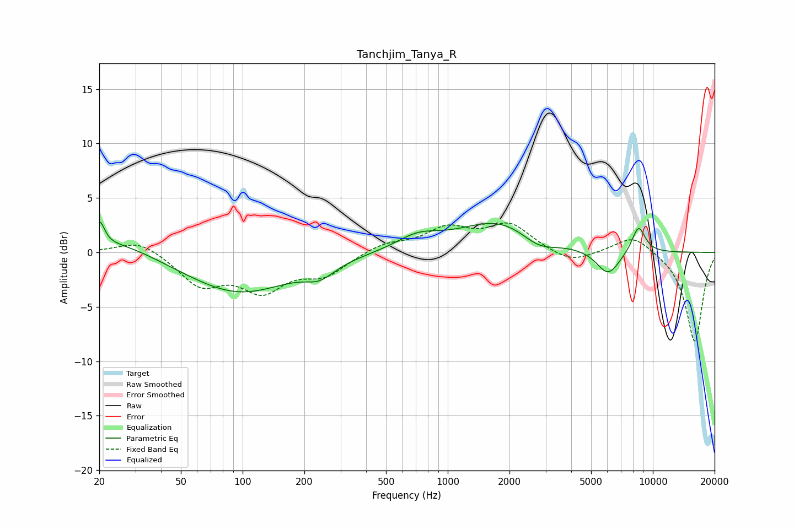

# Tanchjim_Tanya_R
See [usage instructions](https://github.com/jaakkopasanen/AutoEq#usage) for more options and info.

### Parametric EQs
Apply preamp of -2.9 dB when using parametric equalizer.

|   # | Type    |   Fc (Hz) |    Q |   Gain (dB) |
|-----|---------|-----------|------|-------------|
|   1 | Peaking |        20 | 5.97 |         2.2 |
|   2 | Peaking |        25 | 0.83 |         1.3 |
|   3 | Peaking |        96 | 0.55 |        -3.7 |
|   4 | Peaking |       238 | 1.98 |        -1.2 |
|   5 | Peaking |       715 | 1.34 |         1.2 |
|   6 | Peaking |      1808 | 0.71 |         2.9 |
|   7 | Peaking |      2770 | 1.58 |        -1.3 |
|   8 | Peaking |      6078 | 2.56 |        -2.9 |
|   9 | Peaking |      6140 | 3.53 |         0.5 |
|  10 | Peaking |      8519 | 3.86 |         2.5 |

### Fixed Band EQs
When using fixed band (also called graphic) equalizer, apply preamp of **-2.8 dB** (if available) and set gains manually with these parameters.

|   # | Type    |   Fc (Hz) |    Q |   Gain (dB) |
|-----|---------|-----------|------|-------------|
|   1 | Peaking |        31 | 1.41 |         1.3 |
|   2 | Peaking |        62 | 1.41 |        -2.8 |
|   3 | Peaking |       125 | 1.41 |        -3.2 |
|   4 | Peaking |       250 | 1.41 |        -1.9 |
|   5 | Peaking |       500 | 1.41 |         0.8 |
|   6 | Peaking |      1000 | 1.41 |         2   |
|   7 | Peaking |      2000 | 1.41 |         2.5 |
|   8 | Peaking |      4000 | 1.41 |        -1.1 |
|   9 | Peaking |      8000 | 1.41 |         1.7 |
|  10 | Peaking |     16000 | 1.41 |        -8.3 |

### Graphs

