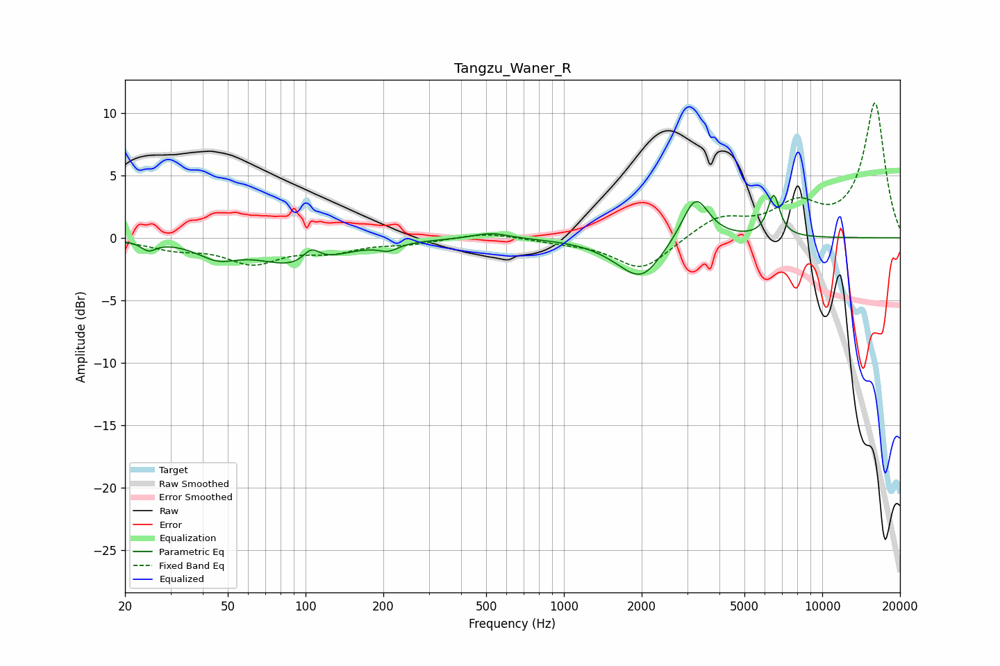

# Tangzu_Waner_R
See [usage instructions](https://github.com/jaakkopasanen/AutoEq#usage) for more options and info.

### Parametric EQs
Apply preamp of -3.5 dB when using parametric equalizer.

|   # | Type    |   Fc (Hz) |    Q |   Gain (dB) |
|-----|---------|-----------|------|-------------|
|   1 | Peaking |        25 | 5.05 |        -0.7 |
|   2 | Peaking |        46 | 1.85 |        -1.2 |
|   3 | Peaking |        94 | 0.96 |        -2.2 |
|   4 | Peaking |       105 | 4.27 |         1.2 |
|   5 | Peaking |       210 | 3.81 |        -0.6 |
|   6 | Peaking |       523 | 2.04 |         0.5 |
|   7 | Peaking |      1666 | 1.39 |        -0.7 |
|   8 | Peaking |      2013 | 1.82 |        -2.8 |
|   9 | Peaking |      3232 | 2.73 |         3.6 |
|  10 | Peaking |      6487 | 5.79 |         3.3 |

### Fixed Band EQs
When using fixed band (also called graphic) equalizer, apply preamp of **-10.9 dB** (if available) and set gains manually with these parameters.

|   # | Type    |   Fc (Hz) |    Q |   Gain (dB) |
|-----|---------|-----------|------|-------------|
|   1 | Peaking |        31 | 1.41 |        -0.8 |
|   2 | Peaking |        62 | 1.41 |        -1.9 |
|   3 | Peaking |       125 | 1.41 |        -0.9 |
|   4 | Peaking |       250 | 1.41 |        -0.4 |
|   5 | Peaking |       500 | 1.41 |         0.5 |
|   6 | Peaking |      1000 | 1.41 |        -0.3 |
|   7 | Peaking |      2000 | 1.41 |        -2.6 |
|   8 | Peaking |      4000 | 1.41 |         1.6 |
|   9 | Peaking |      8000 | 1.41 |         2.4 |
|  10 | Peaking |     16000 | 1.41 |        10.7 |

### Graphs

