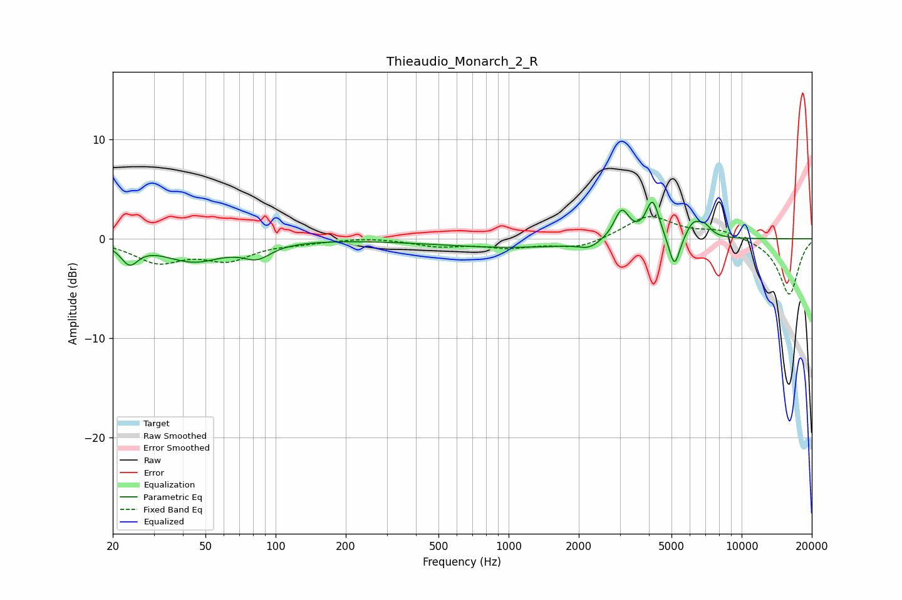

# Thieaudio_Monarch_2_R
See [usage instructions](https://github.com/jaakkopasanen/AutoEq#usage) for more options and info.

### Parametric EQs
Apply preamp of -3.8 dB when using parametric equalizer.

|   # | Type    |   Fc (Hz) |    Q |   Gain (dB) |
|-----|---------|-----------|------|-------------|
|   1 | Peaking |        24 | 3.94 |        -2   |
|   2 | Peaking |        44 | 1.1  |        -2.2 |
|   3 | Peaking |        83 | 2.36 |        -1.4 |
|   4 | Peaking |      1039 | 0.44 |        -0.9 |
|   5 | Peaking |      2213 | 3.22 |        -0.6 |
|   6 | Peaking |      3054 | 4.31 |         3   |
|   7 | Peaking |      4148 | 4.93 |         3.9 |
|   8 | Peaking |      5146 | 5.87 |        -3.4 |
|   9 | Peaking |      6186 | 4.21 |         1.5 |
|  10 | Peaking |      6923 | 4.59 |         1   |

### Fixed Band EQs
When using fixed band (also called graphic) equalizer, apply preamp of **-2.3 dB** (if available) and set gains manually with these parameters.

|   # | Type    |   Fc (Hz) |    Q |   Gain (dB) |
|-----|---------|-----------|------|-------------|
|   1 | Peaking |        31 | 1.41 |        -2.2 |
|   2 | Peaking |        62 | 1.41 |        -1.9 |
|   3 | Peaking |       125 | 1.41 |        -0.3 |
|   4 | Peaking |       250 | 1.41 |         0.2 |
|   5 | Peaking |       500 | 1.41 |        -0.7 |
|   6 | Peaking |      1000 | 1.41 |        -0.8 |
|   7 | Peaking |      2000 | 1.41 |        -1   |
|   8 | Peaking |      4000 | 1.41 |         2.3 |
|   9 | Peaking |      8000 | 1.41 |         0.8 |
|  10 | Peaking |     16000 | 1.41 |        -5.7 |

### Graphs

