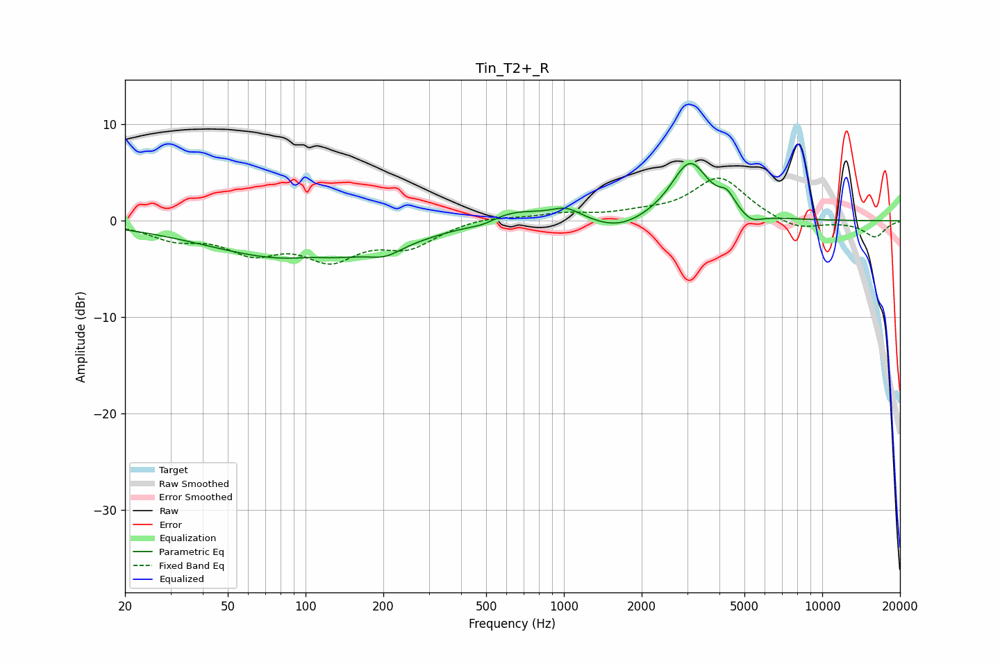

# Tin_T2+_R
See [usage instructions](https://github.com/jaakkopasanen/AutoEq#usage) for more options and info.

### Parametric EQs
Apply preamp of -6.0 dB when using parametric equalizer.

|   # | Type    |   Fc (Hz) |    Q |   Gain (dB) |
|-----|---------|-----------|------|-------------|
|   1 | Peaking |        97 | 0.4  |        -4.1 |
|   2 | Peaking |       103 | 2.06 |         0.3 |
|   3 | Peaking |       204 | 2.34 |        -0.9 |
|   4 | Peaking |       486 | 2.6  |        -0.4 |
|   5 | Peaking |       632 | 1.2  |         1.4 |
|   6 | Peaking |      1023 | 2.34 |         1.2 |
|   7 | Peaking |      1629 | 1.37 |        -1.3 |
|   8 | Peaking |      3075 | 1.93 |         6.1 |
|   9 | Peaking |      4278 | 4.81 |         1.4 |
|  10 | Peaking |      5320 | 3.45 |        -0.9 |

### Fixed Band EQs
When using fixed band (also called graphic) equalizer, apply preamp of **-4.5 dB** (if available) and set gains manually with these parameters.

|   # | Type    |   Fc (Hz) |    Q |   Gain (dB) |
|-----|---------|-----------|------|-------------|
|   1 | Peaking |        31 | 1.41 |        -1.6 |
|   2 | Peaking |        62 | 1.41 |        -2.8 |
|   3 | Peaking |       125 | 1.41 |        -3.5 |
|   4 | Peaking |       250 | 1.41 |        -2.4 |
|   5 | Peaking |       500 | 1.41 |         0.5 |
|   6 | Peaking |      1000 | 1.41 |         0.7 |
|   7 | Peaking |      2000 | 1.41 |         0.6 |
|   8 | Peaking |      4000 | 1.41 |         4.5 |
|   9 | Peaking |      8000 | 1.41 |        -1.1 |
|  10 | Peaking |     16000 | 1.41 |        -1.7 |

### Graphs

