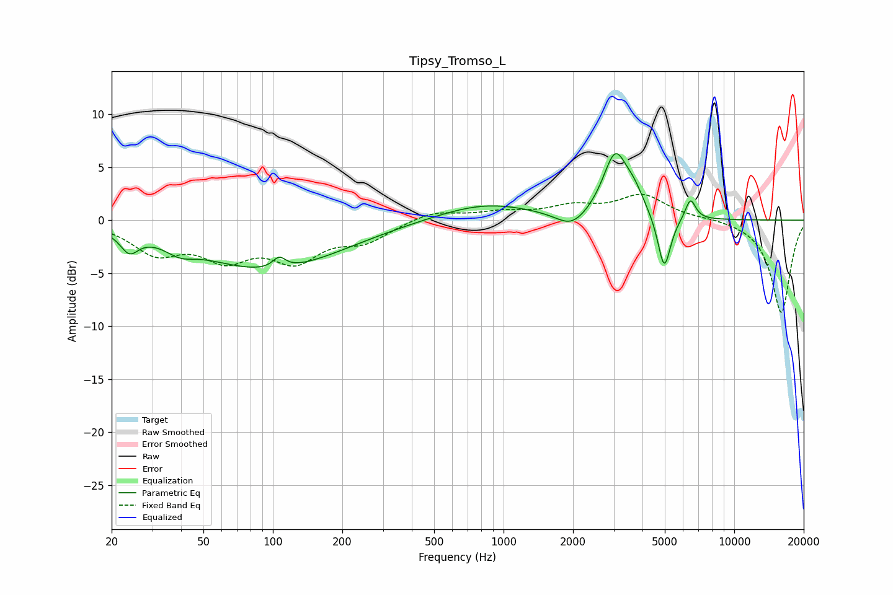

# Tipsy_Tromso_L
See [usage instructions](https://github.com/jaakkopasanen/AutoEq#usage) for more options and info.

### Parametric EQs
Apply preamp of -6.4 dB when using parametric equalizer.

|   # | Type    |   Fc (Hz) |    Q |   Gain (dB) |
|-----|---------|-----------|------|-------------|
|   1 | Peaking |        24 | 3.63 |        -1.8 |
|   2 | Peaking |        39 | 2.3  |        -1   |
|   3 | Peaking |        96 | 0.45 |        -4.6 |
|   4 | Peaking |       106 | 5.06 |         1.1 |
|   5 | Peaking |       832 | 0.67 |         1.6 |
|   6 | Peaking |      1979 | 2.07 |        -1.5 |
|   7 | Peaking |      3046 | 2.63 |         5.9 |
|   8 | Peaking |      3684 | 3.23 |         1.6 |
|   9 | Peaking |      4971 | 4.98 |        -5.2 |
|  10 | Peaking |      6459 | 6    |         2   |

### Fixed Band EQs
When using fixed band (also called graphic) equalizer, apply preamp of **-2.5 dB** (if available) and set gains manually with these parameters.

|   # | Type    |   Fc (Hz) |    Q |   Gain (dB) |
|-----|---------|-----------|------|-------------|
|   1 | Peaking |        31 | 1.41 |        -2.8 |
|   2 | Peaking |        62 | 1.41 |        -3.1 |
|   3 | Peaking |       125 | 1.41 |        -3.4 |
|   4 | Peaking |       250 | 1.41 |        -1.8 |
|   5 | Peaking |       500 | 1.41 |         0.9 |
|   6 | Peaking |      1000 | 1.41 |         0.7 |
|   7 | Peaking |      2000 | 1.41 |         1.1 |
|   8 | Peaking |      4000 | 1.41 |         2.3 |
|   9 | Peaking |      8000 | 1.41 |         0.2 |
|  10 | Peaking |     16000 | 1.41 |        -8.8 |

### Graphs

