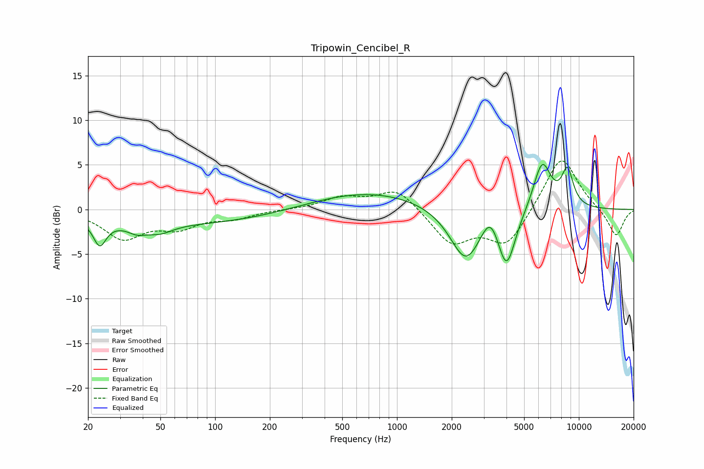

# Tripowin_Cencibel_R
See [usage instructions](https://github.com/jaakkopasanen/AutoEq#usage) for more options and info.

### Parametric EQs
Apply preamp of -5.2 dB when using parametric equalizer.

|   # | Type    |   Fc (Hz) |    Q |   Gain (dB) |
|-----|---------|-----------|------|-------------|
|   1 | Peaking |        23 | 4.09 |        -2.8 |
|   2 | Peaking |        37 | 2.6  |        -0.9 |
|   3 | Peaking |        50 | 2.02 |        -0.9 |
|   4 | Peaking |        69 | 0.25 |        -1.6 |
|   5 | Peaking |       683 | 0.42 |         2.1 |
|   6 | Peaking |      2390 | 1.62 |        -6   |
|   7 | Peaking |      3258 | 2.96 |         2.6 |
|   8 | Peaking |      4001 | 2.84 |        -6.3 |
|   9 | Peaking |      6283 | 2.74 |         5.5 |
|  10 | Peaking |      8656 | 3.97 |         4   |

### Fixed Band EQs
When using fixed band (also called graphic) equalizer, apply preamp of **-5.5 dB** (if available) and set gains manually with these parameters.

|   # | Type    |   Fc (Hz) |    Q |   Gain (dB) |
|-----|---------|-----------|------|-------------|
|   1 | Peaking |        31 | 1.41 |        -3.1 |
|   2 | Peaking |        62 | 1.41 |        -1.8 |
|   3 | Peaking |       125 | 1.41 |        -0.9 |
|   4 | Peaking |       250 | 1.41 |        -0   |
|   5 | Peaking |       500 | 1.41 |         1.3 |
|   6 | Peaking |      1000 | 1.41 |         2.4 |
|   7 | Peaking |      2000 | 1.41 |        -3.8 |
|   8 | Peaking |      4000 | 1.41 |        -4   |
|   9 | Peaking |      8000 | 1.41 |         6.3 |
|  10 | Peaking |     16000 | 1.41 |        -3.1 |

### Graphs

