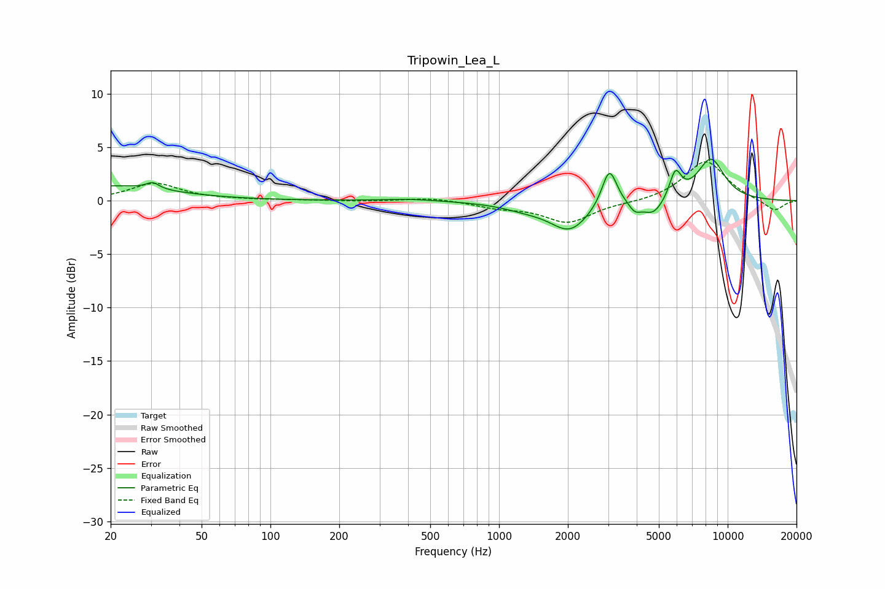

# Tripowin_Lea_L
See [usage instructions](https://github.com/jaakkopasanen/AutoEq#usage) for more options and info.

### Parametric EQs
Apply preamp of -4.0 dB when using parametric equalizer.

|   # | Type    |   Fc (Hz) |    Q |   Gain (dB) |
|-----|---------|-----------|------|-------------|
|   1 | Peaking |        20 | 0.57 |         1.4 |
|   2 | Peaking |        31 | 5.28 |         0.6 |
|   3 | Peaking |       405 | 1.33 |         0.2 |
|   4 | Peaking |      1317 | 1.29 |        -0.6 |
|   5 | Peaking |      2041 | 1.68 |        -2.6 |
|   6 | Peaking |      3037 | 4.36 |         3.6 |
|   7 | Peaking |      3924 | 5.38 |        -0.8 |
|   8 | Peaking |      4731 | 2.93 |        -1.5 |
|   9 | Peaking |      5904 | 5.37 |         2.5 |
|  10 | Peaking |      8439 | 2.12 |         3.9 |

### Fixed Band EQs
When using fixed band (also called graphic) equalizer, apply preamp of **-3.7 dB** (if available) and set gains manually with these parameters.

|   # | Type    |   Fc (Hz) |    Q |   Gain (dB) |
|-----|---------|-----------|------|-------------|
|   1 | Peaking |        31 | 1.41 |         1.6 |
|   2 | Peaking |        62 | 1.41 |         0.1 |
|   3 | Peaking |       125 | 1.41 |         0   |
|   4 | Peaking |       250 | 1.41 |        -0.1 |
|   5 | Peaking |       500 | 1.41 |         0.3 |
|   6 | Peaking |      1000 | 1.41 |        -0.6 |
|   7 | Peaking |      2000 | 1.41 |        -2   |
|   8 | Peaking |      4000 | 1.41 |        -0.1 |
|   9 | Peaking |      8000 | 1.41 |         3.8 |
|  10 | Peaking |     16000 | 1.41 |        -1   |

### Graphs

