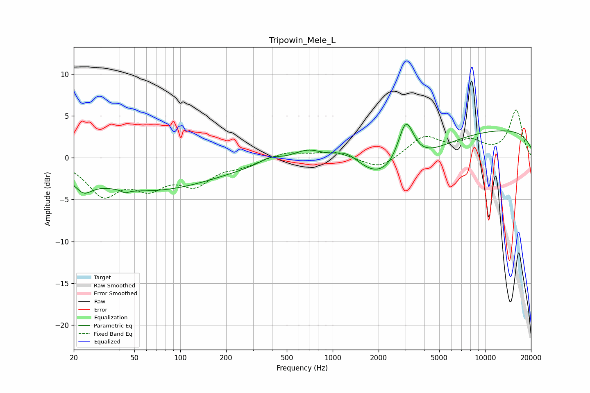

# Tripowin_Mele_L
See [usage instructions](https://github.com/jaakkopasanen/AutoEq#usage) for more options and info.

### Parametric EQs
Apply preamp of -4.1 dB when using parametric equalizer.

|   # | Type    |   Fc (Hz) |    Q |   Gain (dB) |
|-----|---------|-----------|------|-------------|
|   1 | Peaking |        23 | 2.63 |        -1.6 |
|   2 | Peaking |        33 | 0.37 |        -1.8 |
|   3 | Peaking |        44 | 5.88 |        -0.4 |
|   4 | Peaking |        90 | 0.37 |        -2.6 |
|   5 | Peaking |       386 | 2.06 |         0.7 |
|   6 | Peaking |       694 | 1.38 |         1.5 |
|   7 | Peaking |      1244 | 1.4  |         2.2 |
|   8 | Peaking |      2324 | 0.55 |        -5   |
|   9 | Peaking |      3019 | 2.59 |         5.8 |
|  10 | Peaking |     10000 | 0.18 |         3.6 |

### Fixed Band EQs
When using fixed band (also called graphic) equalizer, apply preamp of **-5.8 dB** (if available) and set gains manually with these parameters.

|   # | Type    |   Fc (Hz) |    Q |   Gain (dB) |
|-----|---------|-----------|------|-------------|
|   1 | Peaking |        31 | 1.41 |        -4.2 |
|   2 | Peaking |        62 | 1.41 |        -2.9 |
|   3 | Peaking |       125 | 1.41 |        -2.8 |
|   4 | Peaking |       250 | 1.41 |        -0.8 |
|   5 | Peaking |       500 | 1.41 |         0.7 |
|   6 | Peaking |      1000 | 1.41 |         0.8 |
|   7 | Peaking |      2000 | 1.41 |        -1.5 |
|   8 | Peaking |      4000 | 1.41 |         2.5 |
|   9 | Peaking |      8000 | 1.41 |         1.7 |
|  10 | Peaking |     16000 | 1.41 |         5.7 |

### Graphs

