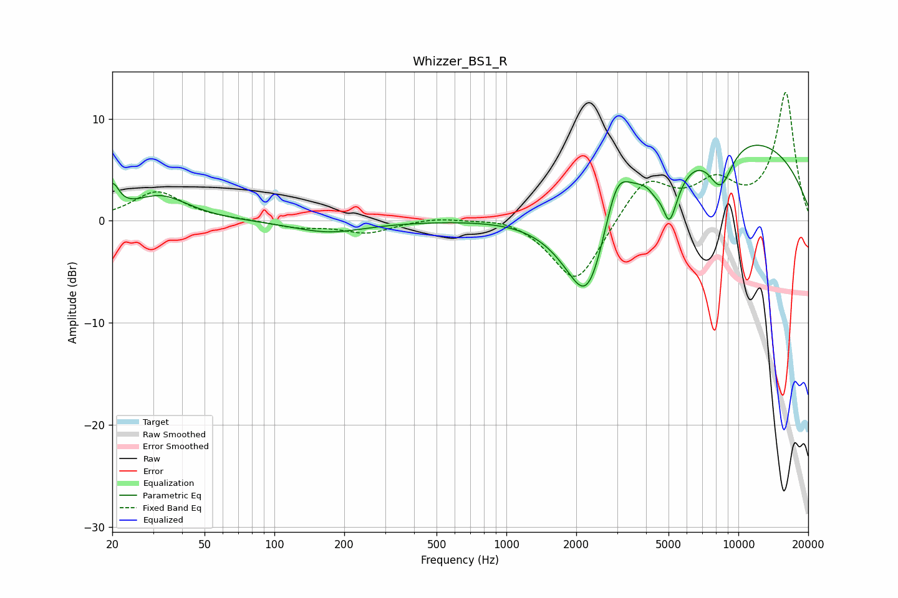

# Whizzer_BS1_R
See [usage instructions](https://github.com/jaakkopasanen/AutoEq#usage) for more options and info.

### Parametric EQs
Apply preamp of -7.5 dB when using parametric equalizer.

|   # | Type    |   Fc (Hz) |    Q |   Gain (dB) |
|-----|---------|-----------|------|-------------|
|   1 | Peaking |        20 | 5.05 |         2.7 |
|   2 | Peaking |        32 | 1.19 |         2.4 |
|   3 | Peaking |       171 | 0.9  |        -1.1 |
|   4 | Peaking |      2245 | 1.27 |       -12.2 |
|   5 | Peaking |      2981 | 2.47 |         5.1 |
|   6 | Peaking |      4439 | 4.15 |        -1.9 |
|   7 | Peaking |      4830 | 2.28 |         8.4 |
|   8 | Peaking |      5004 | 2.71 |       -13.1 |
|   9 | Peaking |      8379 | 2.38 |        -4.4 |
|  10 | Peaking |      8390 | 0.24 |         8.9 |

### Fixed Band EQs
When using fixed band (also called graphic) equalizer, apply preamp of **-12.7 dB** (if available) and set gains manually with these parameters.

|   # | Type    |   Fc (Hz) |    Q |   Gain (dB) |
|-----|---------|-----------|------|-------------|
|   1 | Peaking |        31 | 1.41 |         2.9 |
|   2 | Peaking |        62 | 1.41 |         0.1 |
|   3 | Peaking |       125 | 1.41 |        -0.6 |
|   4 | Peaking |       250 | 1.41 |        -1.2 |
|   5 | Peaking |       500 | 1.41 |         0.4 |
|   6 | Peaking |      1000 | 1.41 |         0.6 |
|   7 | Peaking |      2000 | 1.41 |        -6.4 |
|   8 | Peaking |      4000 | 1.41 |         4.2 |
|   9 | Peaking |      8000 | 1.41 |         3.3 |
|  10 | Peaking |     16000 | 1.41 |        12.5 |

### Graphs

