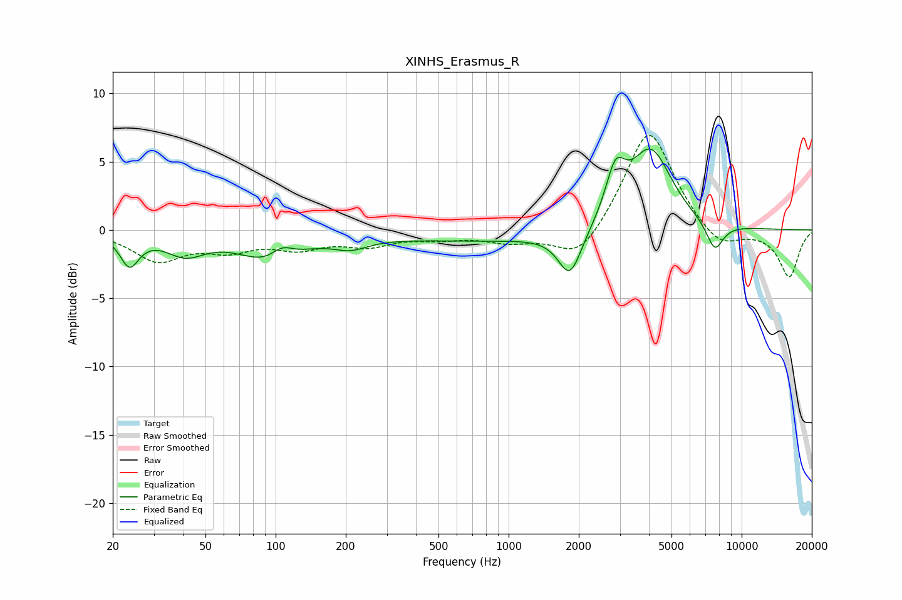

# XINHS_Erasmus_R
See [usage instructions](https://github.com/jaakkopasanen/AutoEq#usage) for more options and info.

### Parametric EQs
Apply preamp of -6.0 dB when using parametric equalizer.

|   # | Type    |   Fc (Hz) |    Q |   Gain (dB) |
|-----|---------|-----------|------|-------------|
|   1 | Peaking |        24 | 3.57 |        -2.3 |
|   2 | Peaking |        41 | 1.68 |        -1.5 |
|   3 | Peaking |        94 | 1.07 |        -2.1 |
|   4 | Peaking |       106 | 3.01 |         0.9 |
|   5 | Peaking |       210 | 1.86 |        -0.8 |
|   6 | Peaking |       895 | 0.3  |        -0.8 |
|   7 | Peaking |      1833 | 2.84 |        -3.3 |
|   8 | Peaking |      2874 | 3.33 |         3.5 |
|   9 | Peaking |      4071 | 1.54 |         5.9 |
|  10 | Peaking |      7667 | 3.61 |        -2.1 |

### Fixed Band EQs
When using fixed band (also called graphic) equalizer, apply preamp of **-7.0 dB** (if available) and set gains manually with these parameters.

|   # | Type    |   Fc (Hz) |    Q |   Gain (dB) |
|-----|---------|-----------|------|-------------|
|   1 | Peaking |        31 | 1.41 |        -2.1 |
|   2 | Peaking |        62 | 1.41 |        -1.2 |
|   3 | Peaking |       125 | 1.41 |        -1.1 |
|   4 | Peaking |       250 | 1.41 |        -1   |
|   5 | Peaking |       500 | 1.41 |        -0.5 |
|   6 | Peaking |      1000 | 1.41 |        -0.8 |
|   7 | Peaking |      2000 | 1.41 |        -2.4 |
|   8 | Peaking |      4000 | 1.41 |         7.6 |
|   9 | Peaking |      8000 | 1.41 |        -1.6 |
|  10 | Peaking |     16000 | 1.41 |        -3.4 |

### Graphs

