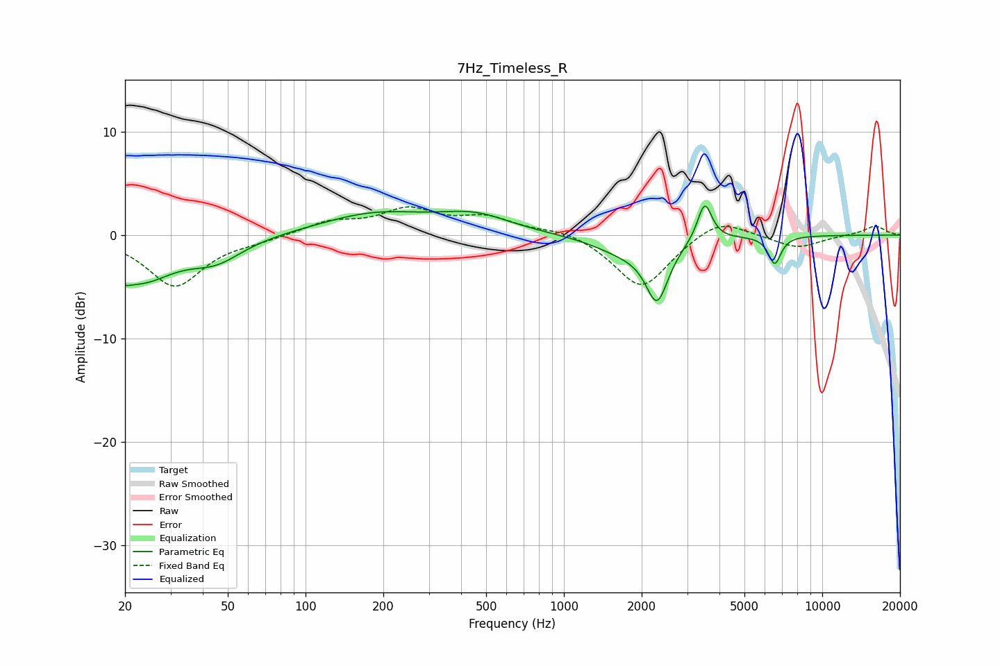

# 7Hz_Timeless_R
See [usage instructions](https://github.com/jaakkopasanen/AutoEq#usage) for more options and info.

### Parametric EQs
Apply preamp of -2.9 dB when using parametric equalizer.

|   # | Type    |   Fc (Hz) |    Q |   Gain (dB) |
|-----|---------|-----------|------|-------------|
|   1 | Peaking |        20 | 5.69 |        -3.9 |
|   2 | Peaking |        20 | 5.84 |         3.1 |
|   3 | Peaking |        23 | 1.07 |        -4.2 |
|   4 | Peaking |        45 | 1.38 |        -2   |
|   5 | Peaking |       185 | 0.68 |         2   |
|   6 | Peaking |       453 | 1.02 |         1.6 |
|   7 | Peaking |      1729 | 1.17 |        -1.5 |
|   8 | Peaking |      2294 | 3.25 |        -5.5 |
|   9 | Peaking |      3507 | 5.08 |         3.8 |
|  10 | Peaking |      6548 | 5.69 |        -2.7 |

### Fixed Band EQs
When using fixed band (also called graphic) equalizer, apply preamp of **-2.8 dB** (if available) and set gains manually with these parameters.

|   # | Type    |   Fc (Hz) |    Q |   Gain (dB) |
|-----|---------|-----------|------|-------------|
|   1 | Peaking |        31 | 1.41 |        -4.9 |
|   2 | Peaking |        62 | 1.41 |        -0.4 |
|   3 | Peaking |       125 | 1.41 |         1.2 |
|   4 | Peaking |       250 | 1.41 |         2.3 |
|   5 | Peaking |       500 | 1.41 |         1.6 |
|   6 | Peaking |      1000 | 1.41 |         0.6 |
|   7 | Peaking |      2000 | 1.41 |        -5.2 |
|   8 | Peaking |      4000 | 1.41 |         1.8 |
|   9 | Peaking |      8000 | 1.41 |        -1.3 |
|  10 | Peaking |     16000 | 1.41 |         0.9 |

### Graphs

