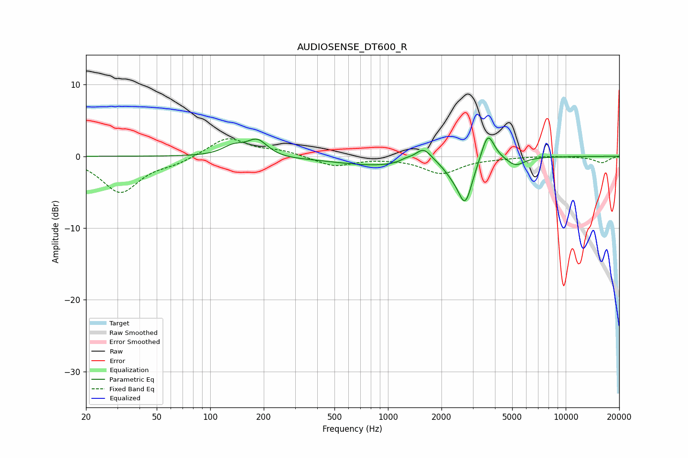

# AUDIOSENSE_DT600_R
See [usage instructions](https://github.com/jaakkopasanen/AutoEq#usage) for more options and info.

### Parametric EQs
Apply preamp of -2.6 dB when using parametric equalizer.

|   # | Type    |   Fc (Hz) |    Q |   Gain (dB) |
|-----|---------|-----------|------|-------------|
|   1 | Peaking |       134 | 2.35 |         1.3 |
|   2 | Peaking |       184 | 2.36 |         2.4 |
|   3 | Peaking |       216 | 0.99 |        -0.3 |
|   4 | Peaking |       902 | 0.57 |        -1.3 |
|   5 | Peaking |      1260 | 4.04 |         0.4 |
|   6 | Peaking |      1585 | 3.02 |         2.1 |
|   7 | Peaking |      2297 | 2.98 |        -1   |
|   8 | Peaking |      2720 | 3.44 |        -6   |
|   9 | Peaking |      3647 | 3.89 |         4.1 |
|  10 | Peaking |      5227 | 2.89 |        -1.2 |

### Fixed Band EQs
When using fixed band (also called graphic) equalizer, apply preamp of **-2.5 dB** (if available) and set gains manually with these parameters.

|   # | Type    |   Fc (Hz) |    Q |   Gain (dB) |
|-----|---------|-----------|------|-------------|
|   1 | Peaking |        31 | 1.41 |        -5   |
|   2 | Peaking |        62 | 1.41 |        -0.8 |
|   3 | Peaking |       125 | 1.41 |         2.7 |
|   4 | Peaking |       250 | 1.41 |         0.7 |
|   5 | Peaking |       500 | 1.41 |        -1.4 |
|   6 | Peaking |      1000 | 1.41 |        -0.1 |
|   7 | Peaking |      2000 | 1.41 |        -2.3 |
|   8 | Peaking |      4000 | 1.41 |        -0.2 |
|   9 | Peaking |      8000 | 1.41 |         0.1 |
|  10 | Peaking |     16000 | 1.41 |        -0.9 |

### Graphs

