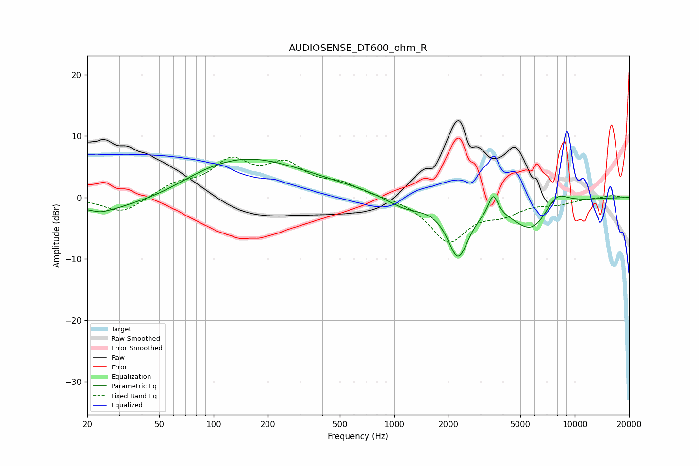

# AUDIOSENSE_DT600_ohm_R
See [usage instructions](https://github.com/jaakkopasanen/AutoEq#usage) for more options and info.

### Parametric EQs
Apply preamp of -6.3 dB when using parametric equalizer.

|   # | Type    |   Fc (Hz) |    Q |   Gain (dB) |
|-----|---------|-----------|------|-------------|
|   1 | Peaking |        24 | 4    |        -0.3 |
|   2 | Peaking |        24 | 0.83 |        -2.6 |
|   3 | Peaking |        51 | 0.85 |        -1.4 |
|   4 | Peaking |       145 | 0.43 |         5.5 |
|   5 | Peaking |       274 | 0.2  |         1.2 |
|   6 | Peaking |      1151 | 1.24 |        -2.1 |
|   7 | Peaking |      2259 | 2.34 |        -9.1 |
|   8 | Peaking |      3535 | 5.55 |         3.5 |
|   9 | Peaking |      5815 | 1.28 |        -5.5 |
|  10 | Peaking |      7867 | 1.94 |         3   |

### Fixed Band EQs
When using fixed band (also called graphic) equalizer, apply preamp of **-6.7 dB** (if available) and set gains manually with these parameters.

|   # | Type    |   Fc (Hz) |    Q |   Gain (dB) |
|-----|---------|-----------|------|-------------|
|   1 | Peaking |        31 | 1.41 |        -2.6 |
|   2 | Peaking |        62 | 1.41 |         1.9 |
|   3 | Peaking |       125 | 1.41 |         5.4 |
|   4 | Peaking |       250 | 1.41 |         4.7 |
|   5 | Peaking |       500 | 1.41 |         1.9 |
|   6 | Peaking |      1000 | 1.41 |         0.2 |
|   7 | Peaking |      2000 | 1.41 |        -7   |
|   8 | Peaking |      4000 | 1.41 |        -2.1 |
|   9 | Peaking |      8000 | 1.41 |        -0.8 |
|  10 | Peaking |     16000 | 1.41 |         0.4 |

### Graphs

