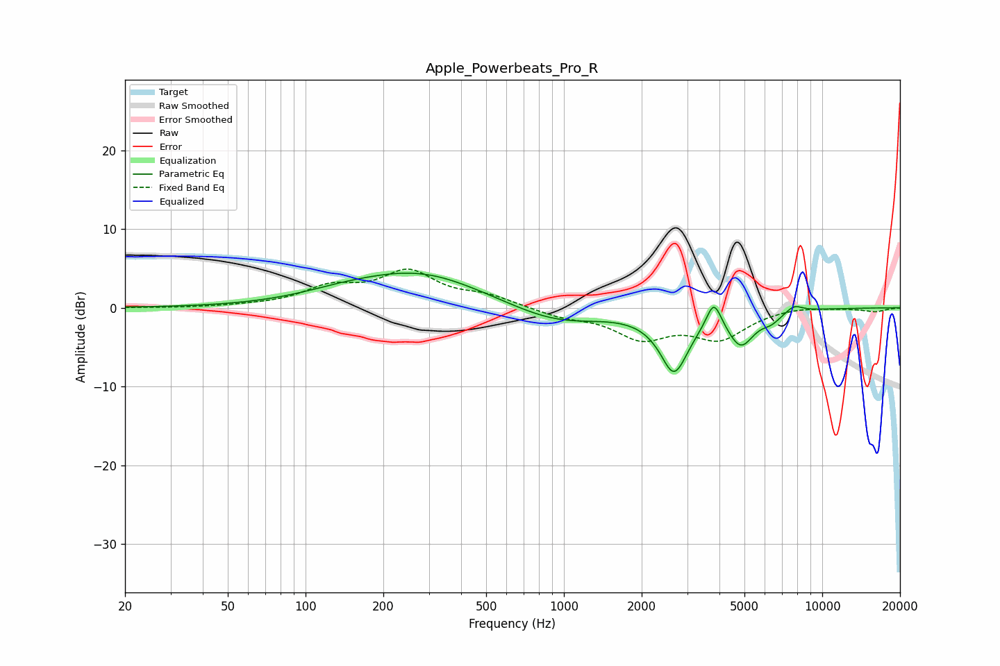

# Apple_Powerbeats_Pro_R
See [usage instructions](https://github.com/jaakkopasanen/AutoEq#usage) for more options and info.

### Parametric EQs
Apply preamp of -4.5 dB when using parametric equalizer.

|   # | Type    |   Fc (Hz) |    Q |   Gain (dB) |
|-----|---------|-----------|------|-------------|
|   1 | Peaking |       137 | 0.84 |         0.8 |
|   2 | Peaking |       277 | 0.58 |         4.4 |
|   3 | Peaking |       934 | 0.77 |        -2.2 |
|   4 | Peaking |      2470 | 2.81 |         0.6 |
|   5 | Peaking |      2657 | 2.45 |        -8.2 |
|   6 | Peaking |      3805 | 5    |         3.5 |
|   7 | Peaking |      4637 | 3.5  |        -0.4 |
|   8 | Peaking |      4871 | 2.78 |        -3.8 |
|   9 | Peaking |      6356 | 3.42 |        -1   |
|  10 | Peaking |      7771 | 4.04 |         0.9 |

### Fixed Band EQs
When using fixed band (also called graphic) equalizer, apply preamp of **-5.0 dB** (if available) and set gains manually with these parameters.

|   # | Type    |   Fc (Hz) |    Q |   Gain (dB) |
|-----|---------|-----------|------|-------------|
|   1 | Peaking |        31 | 1.41 |        -0   |
|   2 | Peaking |        62 | 1.41 |         0.1 |
|   3 | Peaking |       125 | 1.41 |         2.3 |
|   4 | Peaking |       250 | 1.41 |         4.3 |
|   5 | Peaking |       500 | 1.41 |         1.3 |
|   6 | Peaking |      1000 | 1.41 |        -1   |
|   7 | Peaking |      2000 | 1.41 |        -3.6 |
|   8 | Peaking |      4000 | 1.41 |        -3.6 |
|   9 | Peaking |      8000 | 1.41 |         0.3 |
|  10 | Peaking |     16000 | 1.41 |        -0.5 |

### Graphs

