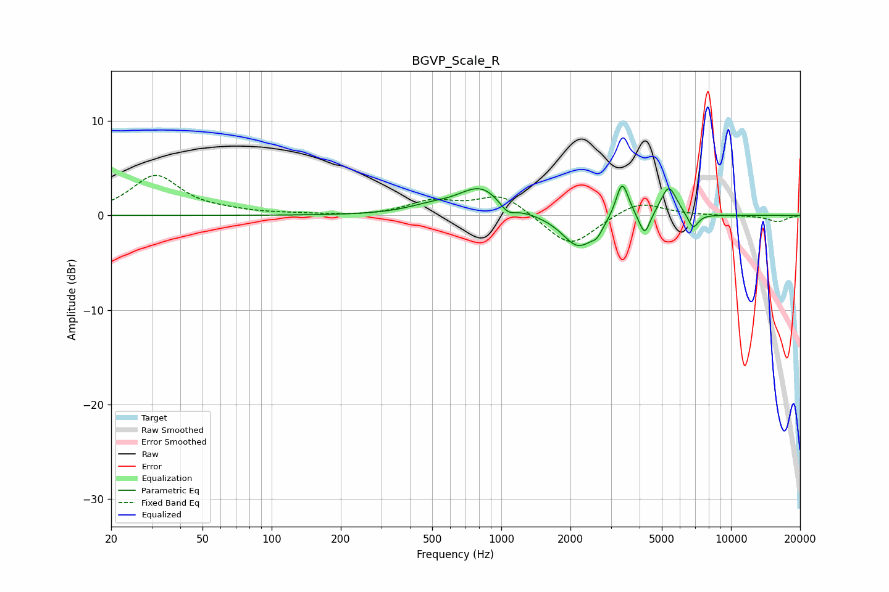

# BGVP_Scale_R
See [usage instructions](https://github.com/jaakkopasanen/AutoEq#usage) for more options and info.

### Parametric EQs
Apply preamp of -3.2 dB when using parametric equalizer.

|   # | Type    |   Fc (Hz) |    Q |   Gain (dB) |
|-----|---------|-----------|------|-------------|
|   1 | Peaking |       488 | 1.44 |         0.7 |
|   2 | Peaking |       815 | 1.46 |         2.9 |
|   3 | Peaking |      1065 | 3.95 |        -1.1 |
|   4 | Peaking |      2168 | 2.01 |        -3.5 |
|   5 | Peaking |      2609 | 6    |        -0.8 |
|   6 | Peaking |      3353 | 5.36 |         3.4 |
|   7 | Peaking |      3430 | 3.96 |         0.6 |
|   8 | Peaking |      4207 | 6    |        -2.5 |
|   9 | Peaking |      5360 | 4    |         3.2 |
|  10 | Peaking |      6842 | 6    |        -1.6 |

### Fixed Band EQs
When using fixed band (also called graphic) equalizer, apply preamp of **-4.3 dB** (if available) and set gains manually with these parameters.

|   # | Type    |   Fc (Hz) |    Q |   Gain (dB) |
|-----|---------|-----------|------|-------------|
|   1 | Peaking |        31 | 1.41 |         4.2 |
|   2 | Peaking |        62 | 1.41 |         0.3 |
|   3 | Peaking |       125 | 1.41 |         0.1 |
|   4 | Peaking |       250 | 1.41 |        -0.1 |
|   5 | Peaking |       500 | 1.41 |         1.4 |
|   6 | Peaking |      1000 | 1.41 |         2.2 |
|   7 | Peaking |      2000 | 1.41 |        -3.5 |
|   8 | Peaking |      4000 | 1.41 |         1.6 |
|   9 | Peaking |      8000 | 1.41 |        -0   |
|  10 | Peaking |     16000 | 1.41 |        -0.7 |

### Graphs

