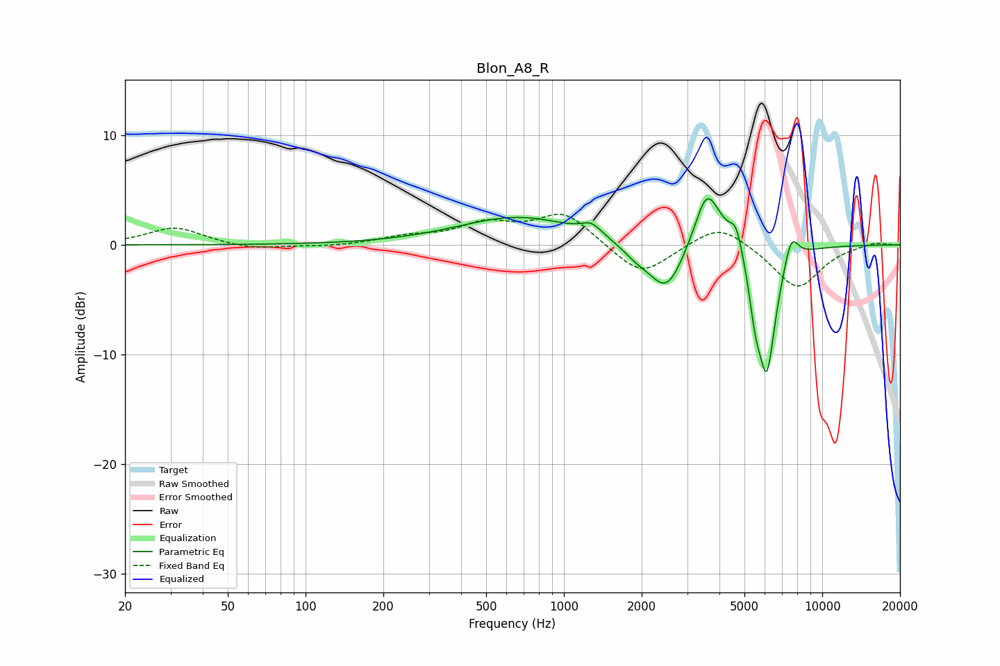

# Blon_A8_R
See [usage instructions](https://github.com/jaakkopasanen/AutoEq#usage) for more options and info.

### Parametric EQs
Apply preamp of -4.3 dB when using parametric equalizer.

|   # | Type    |   Fc (Hz) |    Q |   Gain (dB) |
|-----|---------|-----------|------|-------------|
|   1 | Peaking |       667 | 0.61 |         2.5 |
|   2 | Peaking |      1279 | 3.62 |         1   |
|   3 | Peaking |      1899 | 2.7  |        -0.8 |
|   4 | Peaking |      2498 | 2.03 |        -4.6 |
|   5 | Peaking |      3531 | 4.43 |         1.2 |
|   6 | Peaking |      3639 | 2.33 |         4.7 |
|   7 | Peaking |      4642 | 5.41 |         2.4 |
|   8 | Peaking |      5509 | 6    |        -3.2 |
|   9 | Peaking |      6101 | 3.78 |       -11.4 |
|  10 | Peaking |      7584 | 4.87 |         2.7 |

### Fixed Band EQs
When using fixed band (also called graphic) equalizer, apply preamp of **-2.9 dB** (if available) and set gains manually with these parameters.

|   # | Type    |   Fc (Hz) |    Q |   Gain (dB) |
|-----|---------|-----------|------|-------------|
|   1 | Peaking |        31 | 1.41 |         1.6 |
|   2 | Peaking |        62 | 1.41 |        -0.5 |
|   3 | Peaking |       125 | 1.41 |        -0.2 |
|   4 | Peaking |       250 | 1.41 |         0.6 |
|   5 | Peaking |       500 | 1.41 |         1.7 |
|   6 | Peaking |      1000 | 1.41 |         2.9 |
|   7 | Peaking |      2000 | 1.41 |        -3   |
|   8 | Peaking |      4000 | 1.41 |         2.1 |
|   9 | Peaking |      8000 | 1.41 |        -4   |
|  10 | Peaking |     16000 | 1.41 |         0.3 |

### Graphs

