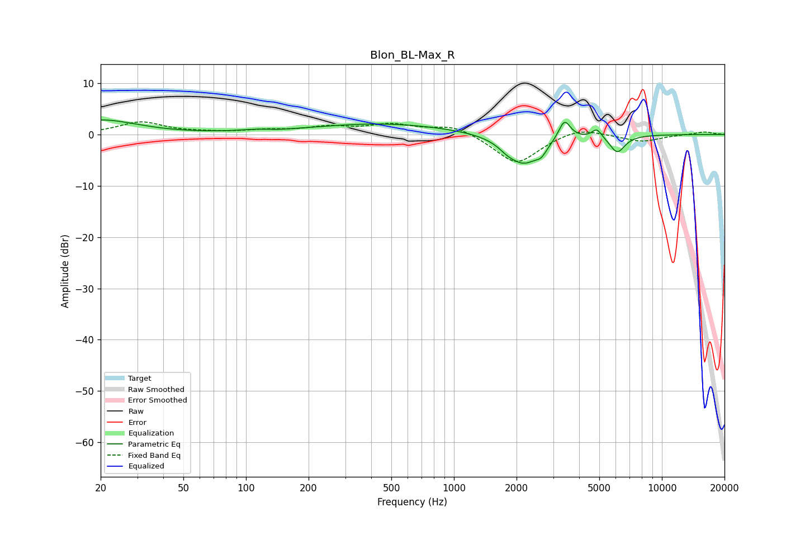

# Blon_BL-Max_R
See [usage instructions](https://github.com/jaakkopasanen/AutoEq#usage) for more options and info.

### Parametric EQs
Apply preamp of -2.9 dB when using parametric equalizer.

|   # | Type    |   Fc (Hz) |    Q |   Gain (dB) |
|-----|---------|-----------|------|-------------|
|   1 | Peaking |        20 | 0.82 |         2.8 |
|   2 | Peaking |       119 | 1.59 |         0.5 |
|   3 | Peaking |       136 | 1.91 |        -0.3 |
|   4 | Peaking |       453 | 0.42 |         2.1 |
|   5 | Peaking |      1802 | 3.63 |        -0.8 |
|   6 | Peaking |      2169 | 1.75 |        -5.7 |
|   7 | Peaking |      2630 | 5.54 |        -1.4 |
|   8 | Peaking |      3400 | 4.93 |         3.9 |
|   9 | Peaking |      4872 | 6    |         1.8 |
|  10 | Peaking |      6104 | 3.79 |        -3.4 |

### Fixed Band EQs
When using fixed band (also called graphic) equalizer, apply preamp of **-2.5 dB** (if available) and set gains manually with these parameters.

|   # | Type    |   Fc (Hz) |    Q |   Gain (dB) |
|-----|---------|-----------|------|-------------|
|   1 | Peaking |        31 | 1.41 |         2.4 |
|   2 | Peaking |        62 | 1.41 |         0.2 |
|   3 | Peaking |       125 | 1.41 |         0.7 |
|   4 | Peaking |       250 | 1.41 |         1.3 |
|   5 | Peaking |       500 | 1.41 |         1.7 |
|   6 | Peaking |      1000 | 1.41 |         1.9 |
|   7 | Peaking |      2000 | 1.41 |        -5.9 |
|   8 | Peaking |      4000 | 1.41 |         1.5 |
|   9 | Peaking |      8000 | 1.41 |        -1.4 |
|  10 | Peaking |     16000 | 1.41 |         0.5 |

### Graphs

