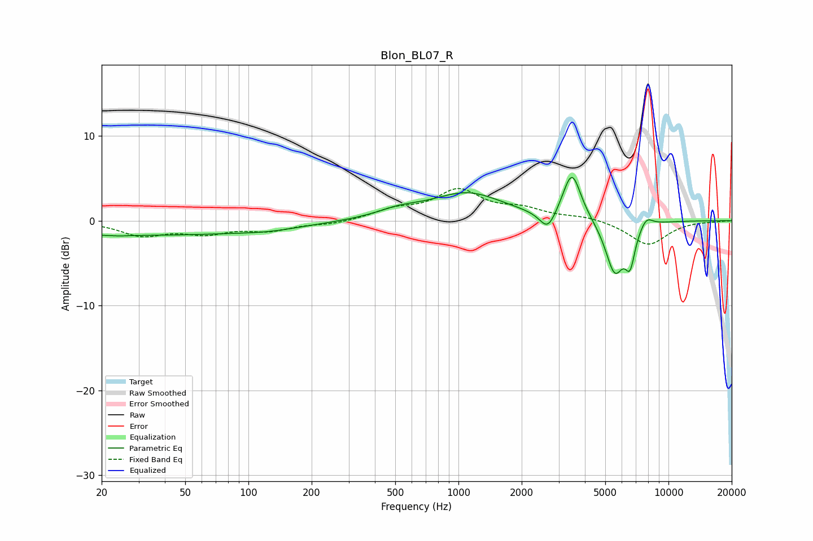

# Blon_BL07_R
See [usage instructions](https://github.com/jaakkopasanen/AutoEq#usage) for more options and info.

### Parametric EQs
Apply preamp of -5.2 dB when using parametric equalizer.

|   # | Type    |   Fc (Hz) |    Q |   Gain (dB) |
|-----|---------|-----------|------|-------------|
|   1 | Peaking |        24 | 3.89 |        -0.1 |
|   2 | Peaking |        27 | 0.18 |        -1.7 |
|   3 | Peaking |       126 | 1.01 |        -0.3 |
|   4 | Peaking |       519 | 1.33 |         0.8 |
|   5 | Peaking |      1105 | 0.82 |         3.2 |
|   6 | Peaking |      2664 | 3.61 |        -2.4 |
|   7 | Peaking |      3469 | 3.24 |         5.7 |
|   8 | Peaking |      5549 | 3.05 |        -6.2 |
|   9 | Peaking |      6566 | 5.85 |        -3.8 |
|  10 | Peaking |      7848 | 4.44 |         1.2 |

### Fixed Band EQs
When using fixed band (also called graphic) equalizer, apply preamp of **-3.9 dB** (if available) and set gains manually with these parameters.

|   # | Type    |   Fc (Hz) |    Q |   Gain (dB) |
|-----|---------|-----------|------|-------------|
|   1 | Peaking |        31 | 1.41 |        -1.6 |
|   2 | Peaking |        62 | 1.41 |        -1.3 |
|   3 | Peaking |       125 | 1.41 |        -1   |
|   4 | Peaking |       250 | 1.41 |        -0.4 |
|   5 | Peaking |       500 | 1.41 |         1.1 |
|   6 | Peaking |      1000 | 1.41 |         3.4 |
|   7 | Peaking |      2000 | 1.41 |         1.2 |
|   8 | Peaking |      4000 | 1.41 |         0.5 |
|   9 | Peaking |      8000 | 1.41 |        -2.9 |
|  10 | Peaking |     16000 | 1.41 |        -0.1 |

### Graphs

