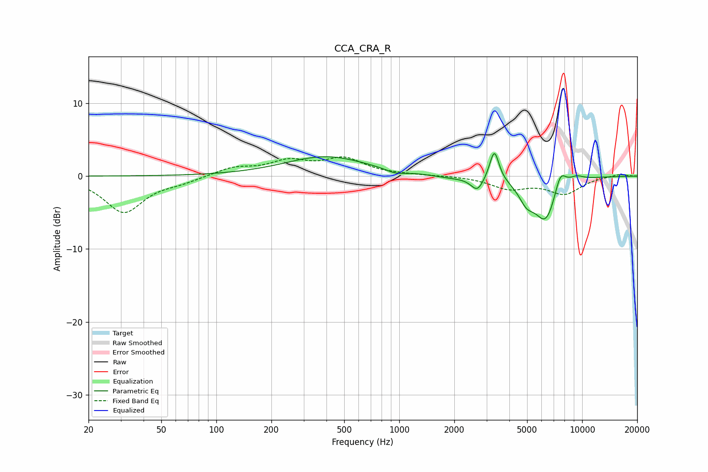

# CCA_CRA_R
See [usage instructions](https://github.com/jaakkopasanen/AutoEq#usage) for more options and info.

### Parametric EQs
Apply preamp of -3.2 dB when using parametric equalizer.

|   # | Type    |   Fc (Hz) |    Q |   Gain (dB) |
|-----|---------|-----------|------|-------------|
|   1 | Peaking |       398 | 0.63 |         2.7 |
|   2 | Peaking |       954 | 2.83 |        -0.5 |
|   3 | Peaking |      1913 | 1.61 |        -0.3 |
|   4 | Peaking |      2675 | 4.06 |        -1.9 |
|   5 | Peaking |      3267 | 4.62 |         1   |
|   6 | Peaking |      3319 | 5.92 |         3.3 |
|   7 | Peaking |      4970 | 3.19 |        -2.3 |
|   8 | Peaking |      6333 | 2.19 |        -6   |
|   9 | Peaking |      7591 | 4.13 |         2.9 |
|  10 | Peaking |      9284 | 3.09 |         0.7 |

### Fixed Band EQs
When using fixed band (also called graphic) equalizer, apply preamp of **-2.7 dB** (if available) and set gains manually with these parameters.

|   # | Type    |   Fc (Hz) |    Q |   Gain (dB) |
|-----|---------|-----------|------|-------------|
|   1 | Peaking |        31 | 1.41 |        -4.9 |
|   2 | Peaking |        62 | 1.41 |        -0.7 |
|   3 | Peaking |       125 | 1.41 |         1.1 |
|   4 | Peaking |       250 | 1.41 |         1.9 |
|   5 | Peaking |       500 | 1.41 |         2.2 |
|   6 | Peaking |      1000 | 1.41 |         0.1 |
|   7 | Peaking |      2000 | 1.41 |         0.1 |
|   8 | Peaking |      4000 | 1.41 |        -1.6 |
|   9 | Peaking |      8000 | 1.41 |        -2.3 |
|  10 | Peaking |     16000 | 1.41 |         0.3 |

### Graphs

