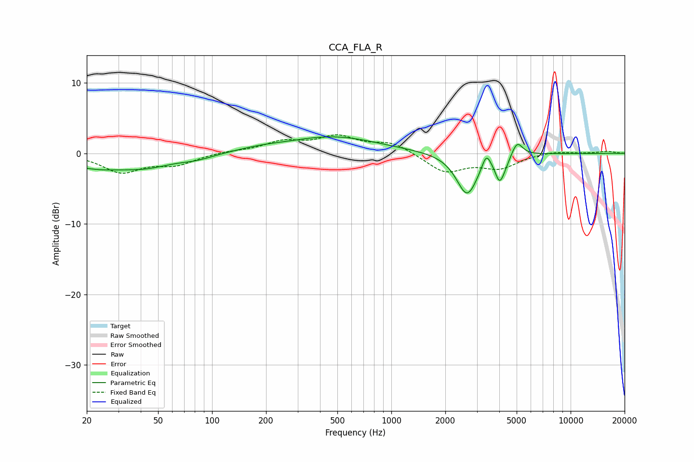

# CCA_FLA_R
See [usage instructions](https://github.com/jaakkopasanen/AutoEq#usage) for more options and info.

### Parametric EQs
Apply preamp of -2.4 dB when using parametric equalizer.

|   # | Type    |   Fc (Hz) |    Q |   Gain (dB) |
|-----|---------|-----------|------|-------------|
|   1 | Peaking |        22 | 0.76 |        -1.8 |
|   2 | Peaking |        43 | 0.99 |        -1.3 |
|   3 | Peaking |        82 | 1.49 |        -0.6 |
|   4 | Peaking |       184 | 1.08 |         0.4 |
|   5 | Peaking |       474 | 0.56 |         2.3 |
|   6 | Peaking |      2646 | 2.4  |        -6   |
|   7 | Peaking |      3385 | 6    |         2.1 |
|   8 | Peaking |      4007 | 5.97 |        -2.8 |
|   9 | Peaking |      4278 | 4.7  |        -1.1 |
|  10 | Peaking |      5027 | 4.5  |         2.2 |

### Fixed Band EQs
When using fixed band (also called graphic) equalizer, apply preamp of **-2.7 dB** (if available) and set gains manually with these parameters.

|   # | Type    |   Fc (Hz) |    Q |   Gain (dB) |
|-----|---------|-----------|------|-------------|
|   1 | Peaking |        31 | 1.41 |        -2.6 |
|   2 | Peaking |        62 | 1.41 |        -1.5 |
|   3 | Peaking |       125 | 1.41 |         0.3 |
|   4 | Peaking |       250 | 1.41 |         1.5 |
|   5 | Peaking |       500 | 1.41 |         2.2 |
|   6 | Peaking |      1000 | 1.41 |         1.5 |
|   7 | Peaking |      2000 | 1.41 |        -2.6 |
|   8 | Peaking |      4000 | 1.41 |        -1.9 |
|   9 | Peaking |      8000 | 1.41 |         0.4 |
|  10 | Peaking |     16000 | 1.41 |         0.3 |

### Graphs

