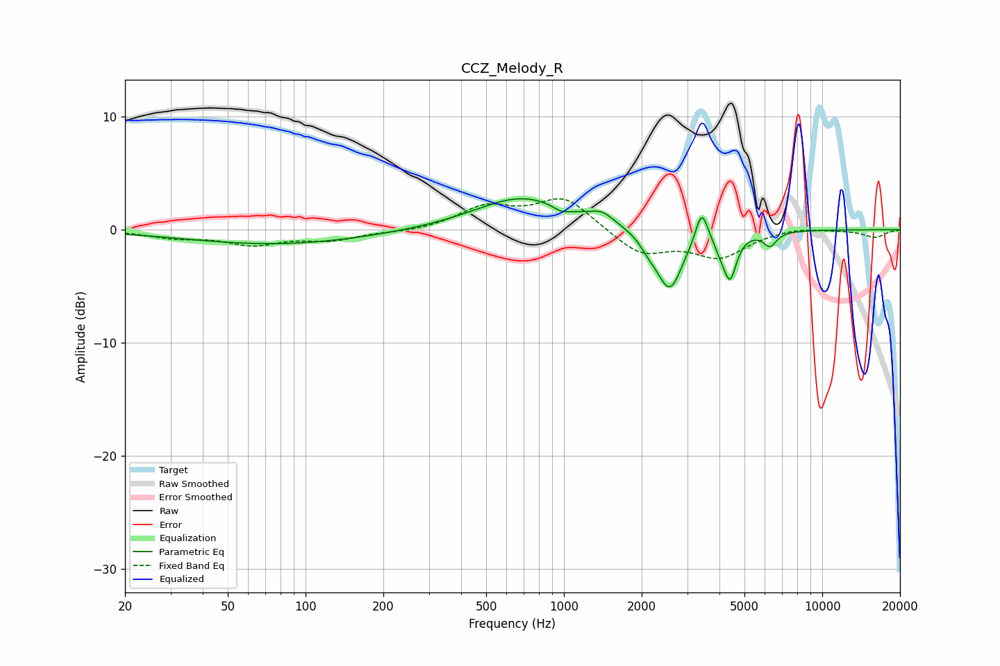

# CCZ_Melody_R
See [usage instructions](https://github.com/jaakkopasanen/AutoEq#usage) for more options and info.

### Parametric EQs
Apply preamp of -2.8 dB when using parametric equalizer.

|   # | Type    |   Fc (Hz) |    Q |   Gain (dB) |
|-----|---------|-----------|------|-------------|
|   1 | Peaking |        78 | 0.4  |        -1.3 |
|   2 | Peaking |       692 | 0.77 |         2.9 |
|   3 | Peaking |       980 | 4.13 |        -0.5 |
|   4 | Peaking |      1405 | 3.1  |         0.9 |
|   5 | Peaking |      2132 | 4.31 |        -0.8 |
|   6 | Peaking |      2567 | 2.79 |        -5.3 |
|   7 | Peaking |      3416 | 5.98 |         2.9 |
|   8 | Peaking |      4014 | 6    |        -0.8 |
|   9 | Peaking |      4394 | 5.56 |        -3.9 |
|  10 | Peaking |      6275 | 5.47 |        -1.2 |

### Fixed Band EQs
When using fixed band (also called graphic) equalizer, apply preamp of **-2.8 dB** (if available) and set gains manually with these parameters.

|   # | Type    |   Fc (Hz) |    Q |   Gain (dB) |
|-----|---------|-----------|------|-------------|
|   1 | Peaking |        31 | 1.41 |        -0.6 |
|   2 | Peaking |        62 | 1.41 |        -1.2 |
|   3 | Peaking |       125 | 1.41 |        -0.8 |
|   4 | Peaking |       250 | 1.41 |        -0.2 |
|   5 | Peaking |       500 | 1.41 |         1.9 |
|   6 | Peaking |      1000 | 1.41 |         2.8 |
|   7 | Peaking |      2000 | 1.41 |        -2.2 |
|   8 | Peaking |      4000 | 1.41 |        -2.3 |
|   9 | Peaking |      8000 | 1.41 |         0.3 |
|  10 | Peaking |     16000 | 1.41 |        -0.7 |

### Graphs

