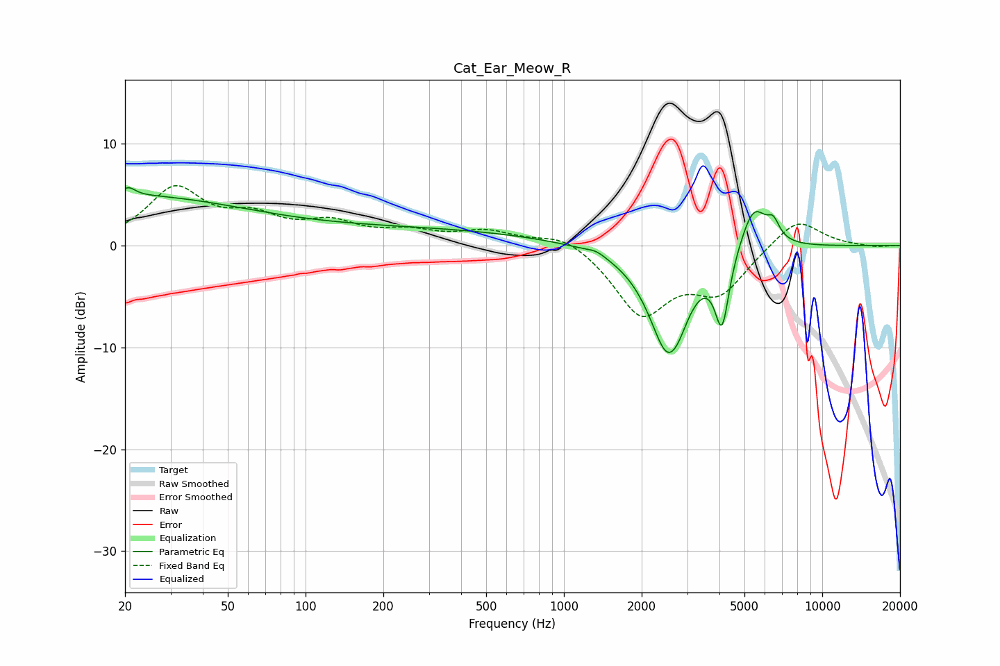

# Cat_Ear_Meow_R
See [usage instructions](https://github.com/jaakkopasanen/AutoEq#usage) for more options and info.

### Parametric EQs
Apply preamp of -5.8 dB when using parametric equalizer.

|   # | Type    |   Fc (Hz) |    Q |   Gain (dB) |
|-----|---------|-----------|------|-------------|
|   1 | Peaking |        20 | 0.29 |         4.8 |
|   2 | Peaking |        20 | 6    |        -1.5 |
|   3 | Peaking |        21 | 5.79 |         2.3 |
|   4 | Peaking |       261 | 0.29 |         1.5 |
|   5 | Peaking |      1335 | 4.22 |         0.4 |
|   6 | Peaking |      2517 | 1.88 |       -10.1 |
|   7 | Peaking |      2792 | 3.93 |        -0.9 |
|   8 | Peaking |      4093 | 5.1  |        -6.9 |
|   9 | Peaking |      5426 | 2.64 |         4.6 |
|  10 | Peaking |      6467 | 5.89 |         1.6 |

### Fixed Band EQs
When using fixed band (also called graphic) equalizer, apply preamp of **-6.0 dB** (if available) and set gains manually with these parameters.

|   # | Type    |   Fc (Hz) |    Q |   Gain (dB) |
|-----|---------|-----------|------|-------------|
|   1 | Peaking |        31 | 1.41 |         5.4 |
|   2 | Peaking |        62 | 1.41 |         2.3 |
|   3 | Peaking |       125 | 1.41 |         1.9 |
|   4 | Peaking |       250 | 1.41 |         1.1 |
|   5 | Peaking |       500 | 1.41 |         1.3 |
|   6 | Peaking |      1000 | 1.41 |         1.4 |
|   7 | Peaking |      2000 | 1.41 |        -6.6 |
|   8 | Peaking |      4000 | 1.41 |        -4.2 |
|   9 | Peaking |      8000 | 1.41 |         2.9 |
|  10 | Peaking |     16000 | 1.41 |        -0.2 |

### Graphs

