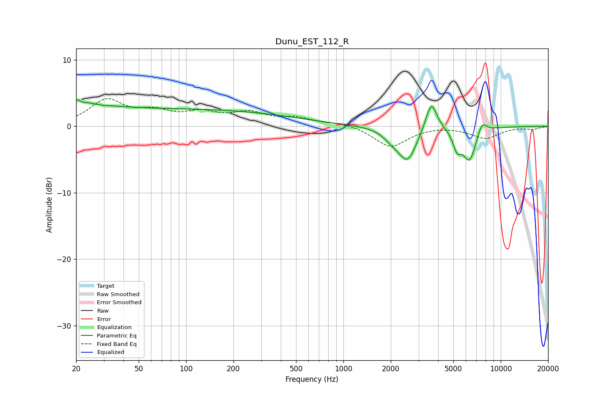

# Dunu_EST_112_R
See [usage instructions](https://github.com/jaakkopasanen/AutoEq#usage) for more options and info.

### Parametric EQs
Apply preamp of -4.1 dB when using parametric equalizer.

|   # | Type    |   Fc (Hz) |    Q |   Gain (dB) |
|-----|---------|-----------|------|-------------|
|   1 | Peaking |        20 | 5.98 |         1.4 |
|   2 | Peaking |        23 | 2.8  |         0.8 |
|   3 | Peaking |        29 | 0.88 |         0.9 |
|   4 | Peaking |        96 | 0.19 |         2.5 |
|   5 | Peaking |      1992 | 2.98 |        -0.9 |
|   6 | Peaking |      2542 | 2.32 |        -5.2 |
|   7 | Peaking |      3617 | 3.84 |         4.6 |
|   8 | Peaking |      5282 | 5.55 |        -2.5 |
|   9 | Peaking |      6320 | 3.2  |        -5   |
|  10 | Peaking |      7610 | 4.7  |         1.9 |

### Fixed Band EQs
When using fixed band (also called graphic) equalizer, apply preamp of **-4.3 dB** (if available) and set gains manually with these parameters.

|   # | Type    |   Fc (Hz) |    Q |   Gain (dB) |
|-----|---------|-----------|------|-------------|
|   1 | Peaking |        31 | 1.41 |         3.7 |
|   2 | Peaking |        62 | 1.41 |         1.8 |
|   3 | Peaking |       125 | 1.41 |         1.7 |
|   4 | Peaking |       250 | 1.41 |         1.8 |
|   5 | Peaking |       500 | 1.41 |         1.1 |
|   6 | Peaking |      1000 | 1.41 |         0.5 |
|   7 | Peaking |      2000 | 1.41 |        -3.1 |
|   8 | Peaking |      4000 | 1.41 |         0.1 |
|   9 | Peaking |      8000 | 1.41 |        -1.7 |
|  10 | Peaking |     16000 | 1.41 |        -0.4 |

### Graphs

