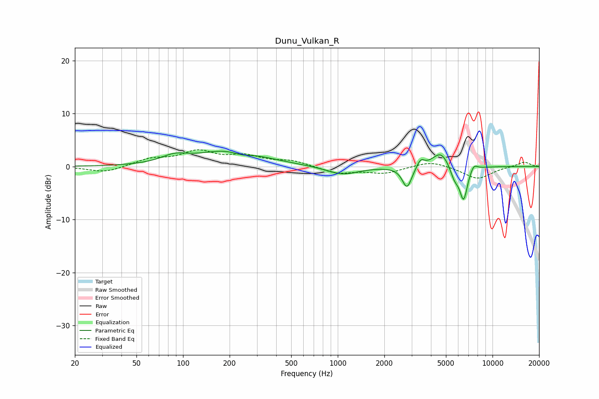

# Dunu_Vulkan_R
See [usage instructions](https://github.com/jaakkopasanen/AutoEq#usage) for more options and info.

### Parametric EQs
Apply preamp of -3.0 dB when using parametric equalizer.

|   # | Type    |   Fc (Hz) |    Q |   Gain (dB) |
|-----|---------|-----------|------|-------------|
|   1 | Peaking |        88 | 1.63 |         1.4 |
|   2 | Peaking |       207 | 0.7  |         3.2 |
|   3 | Peaking |       239 | 2.12 |        -0.8 |
|   4 | Peaking |      1075 | 1.35 |        -1.6 |
|   5 | Peaking |      2803 | 4.67 |        -4.1 |
|   6 | Peaking |      3430 | 5.99 |         1.5 |
|   7 | Peaking |      4640 | 2.59 |         3   |
|   8 | Peaking |      5683 | 4.79 |        -2.3 |
|   9 | Peaking |      6503 | 5.32 |        -6.2 |
|  10 | Peaking |      7567 | 5.97 |         1.2 |

### Fixed Band EQs
When using fixed band (also called graphic) equalizer, apply preamp of **-3.3 dB** (if available) and set gains manually with these parameters.

|   # | Type    |   Fc (Hz) |    Q |   Gain (dB) |
|-----|---------|-----------|------|-------------|
|   1 | Peaking |        31 | 1.41 |        -1.2 |
|   2 | Peaking |        62 | 1.41 |         1.3 |
|   3 | Peaking |       125 | 1.41 |         2.6 |
|   4 | Peaking |       250 | 1.41 |         1.7 |
|   5 | Peaking |       500 | 1.41 |         1   |
|   6 | Peaking |      1000 | 1.41 |        -1.3 |
|   7 | Peaking |      2000 | 1.41 |        -1.2 |
|   8 | Peaking |      4000 | 1.41 |         1.1 |
|   9 | Peaking |      8000 | 1.41 |        -2.3 |
|  10 | Peaking |     16000 | 1.41 |         0.9 |

### Graphs

