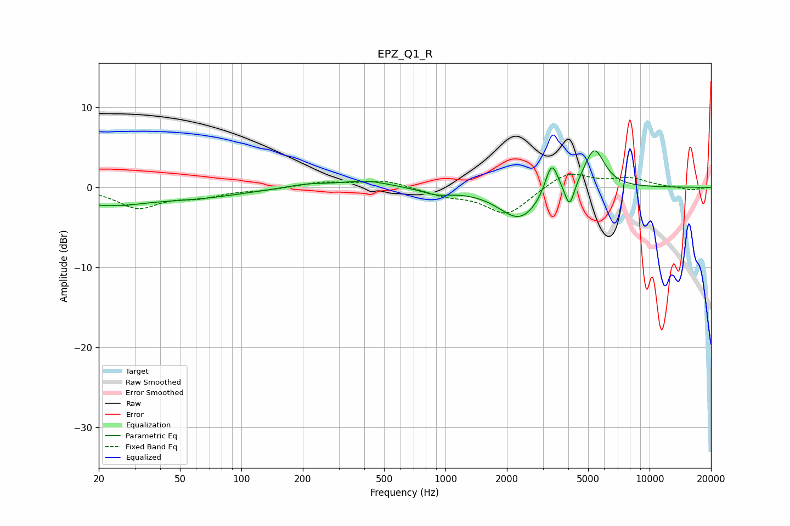

# EPZ_Q1_R
See [usage instructions](https://github.com/jaakkopasanen/AutoEq#usage) for more options and info.

### Parametric EQs
Apply preamp of -4.7 dB when using parametric equalizer.

|   # | Type    |   Fc (Hz) |    Q |   Gain (dB) |
|-----|---------|-----------|------|-------------|
|   1 | Peaking |        20 | 5    |        -0.3 |
|   2 | Peaking |        24 | 0.95 |        -1.6 |
|   3 | Peaking |        56 | 0.55 |        -1.2 |
|   4 | Peaking |       210 | 1.27 |         0.5 |
|   5 | Peaking |       408 | 1.22 |         0.8 |
|   6 | Peaking |       903 | 1.93 |        -0.7 |
|   7 | Peaking |      2317 | 1.39 |        -4.1 |
|   8 | Peaking |      3314 | 4.4  |         4.3 |
|   9 | Peaking |      4054 | 6    |        -3.1 |
|  10 | Peaking |      5356 | 2.74 |         5.1 |

### Fixed Band EQs
When using fixed band (also called graphic) equalizer, apply preamp of **-1.7 dB** (if available) and set gains manually with these parameters.

|   # | Type    |   Fc (Hz) |    Q |   Gain (dB) |
|-----|---------|-----------|------|-------------|
|   1 | Peaking |        31 | 1.41 |        -2.5 |
|   2 | Peaking |        62 | 1.41 |        -1   |
|   3 | Peaking |       125 | 1.41 |        -0.3 |
|   4 | Peaking |       250 | 1.41 |         0.6 |
|   5 | Peaking |       500 | 1.41 |         0.9 |
|   6 | Peaking |      1000 | 1.41 |        -0.9 |
|   7 | Peaking |      2000 | 1.41 |        -3.4 |
|   8 | Peaking |      4000 | 1.41 |         2   |
|   9 | Peaking |      8000 | 1.41 |         1   |
|  10 | Peaking |     16000 | 1.41 |        -0.4 |

### Graphs

