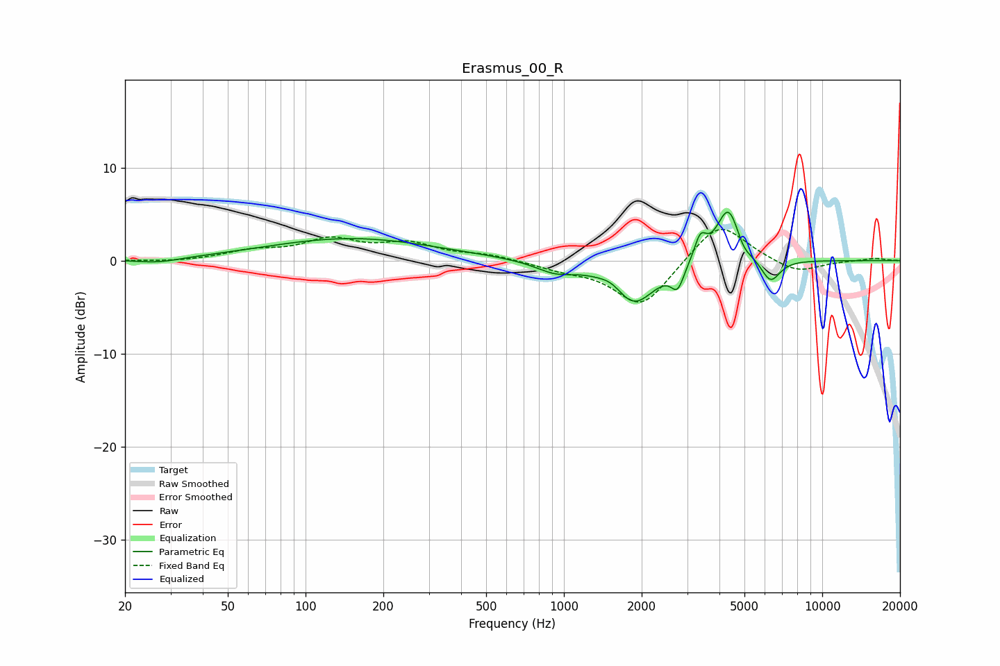

# Erasmus_00_R
See [usage instructions](https://github.com/jaakkopasanen/AutoEq#usage) for more options and info.

### Parametric EQs
Apply preamp of -5.3 dB when using parametric equalizer.

|   # | Type    |   Fc (Hz) |    Q |   Gain (dB) |
|-----|---------|-----------|------|-------------|
|   1 | Peaking |        27 | 1.67 |        -0.5 |
|   2 | Peaking |       151 | 0.43 |         2.4 |
|   3 | Peaking |       927 | 1.81 |        -1.2 |
|   4 | Peaking |      1542 | 3.11 |         0.8 |
|   5 | Peaking |      1858 | 1.67 |        -4.7 |
|   6 | Peaking |      2755 | 5.71 |        -2.3 |
|   7 | Peaking |      3374 | 5.99 |         2.5 |
|   8 | Peaking |      4338 | 3.03 |         6.1 |
|   9 | Peaking |      4940 | 4.72 |        -1.1 |
|  10 | Peaking |      6302 | 3.66 |        -2.6 |

### Fixed Band EQs
When using fixed band (also called graphic) equalizer, apply preamp of **-3.4 dB** (if available) and set gains manually with these parameters.

|   # | Type    |   Fc (Hz) |    Q |   Gain (dB) |
|-----|---------|-----------|------|-------------|
|   1 | Peaking |        31 | 1.41 |        -0.2 |
|   2 | Peaking |        62 | 1.41 |         0.9 |
|   3 | Peaking |       125 | 1.41 |         2.1 |
|   4 | Peaking |       250 | 1.41 |         1.7 |
|   5 | Peaking |       500 | 1.41 |         0.6 |
|   6 | Peaking |      1000 | 1.41 |        -0.8 |
|   7 | Peaking |      2000 | 1.41 |        -5.1 |
|   8 | Peaking |      4000 | 1.41 |         4.4 |
|   9 | Peaking |      8000 | 1.41 |        -1.4 |
|  10 | Peaking |     16000 | 1.41 |         0.3 |

### Graphs

