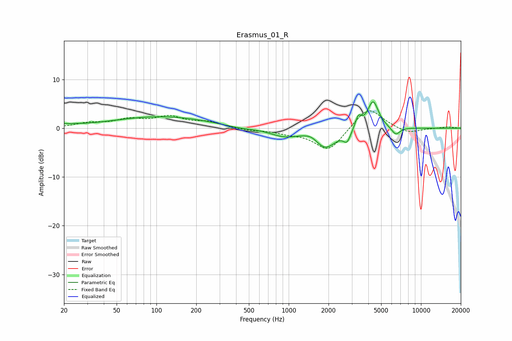

# Erasmus_01_R
See [usage instructions](https://github.com/jaakkopasanen/AutoEq#usage) for more options and info.

### Parametric EQs
Apply preamp of -5.5 dB when using parametric equalizer.

|   # | Type    |   Fc (Hz) |    Q |   Gain (dB) |
|-----|---------|-----------|------|-------------|
|   1 | Peaking |        20 | 1.48 |         0.5 |
|   2 | Peaking |       109 | 0.39 |         2.4 |
|   3 | Peaking |       426 | 1.29 |        -0.4 |
|   4 | Peaking |       922 | 1.33 |        -1.5 |
|   5 | Peaking |      1487 | 2.61 |         0.9 |
|   6 | Peaking |      1891 | 1.72 |        -4   |
|   7 | Peaking |      2761 | 5.12 |        -2.2 |
|   8 | Peaking |      3358 | 5.96 |         2.5 |
|   9 | Peaking |      4343 | 3.36 |         5.7 |
|  10 | Peaking |      6442 | 4.31 |        -1.6 |

### Fixed Band EQs
When using fixed band (also called graphic) equalizer, apply preamp of **-3.7 dB** (if available) and set gains manually with these parameters.

|   # | Type    |   Fc (Hz) |    Q |   Gain (dB) |
|-----|---------|-----------|------|-------------|
|   1 | Peaking |        31 | 1.41 |         0.9 |
|   2 | Peaking |        62 | 1.41 |         1.6 |
|   3 | Peaking |       125 | 1.41 |         2.1 |
|   4 | Peaking |       250 | 1.41 |         1.1 |
|   5 | Peaking |       500 | 1.41 |        -0.4 |
|   6 | Peaking |      1000 | 1.41 |        -0.8 |
|   7 | Peaking |      2000 | 1.41 |        -4.7 |
|   8 | Peaking |      4000 | 1.41 |         4.6 |
|   9 | Peaking |      8000 | 1.41 |        -1.2 |
|  10 | Peaking |     16000 | 1.41 |         0.3 |

### Graphs

