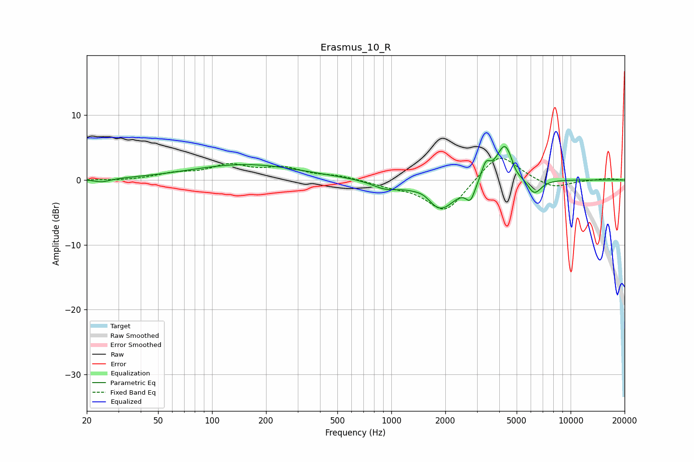

# Erasmus_10_R
See [usage instructions](https://github.com/jaakkopasanen/AutoEq#usage) for more options and info.

### Parametric EQs
Apply preamp of -5.3 dB when using parametric equalizer.

|   # | Type    |   Fc (Hz) |    Q |   Gain (dB) |
|-----|---------|-----------|------|-------------|
|   1 | Peaking |        24 | 3.13 |        -0.5 |
|   2 | Peaking |       154 | 0.46 |         2.4 |
|   3 | Peaking |       926 | 1.89 |        -1.1 |
|   4 | Peaking |      1530 | 3.08 |         0.8 |
|   5 | Peaking |      1867 | 1.64 |        -4.7 |
|   6 | Peaking |      2763 | 5.67 |        -2.4 |
|   7 | Peaking |      3364 | 6    |         2.4 |
|   8 | Peaking |      4308 | 2.91 |         6   |
|   9 | Peaking |      4952 | 5.06 |        -1   |
|  10 | Peaking |      6256 | 3.4  |        -2.5 |

### Fixed Band EQs
When using fixed band (also called graphic) equalizer, apply preamp of **-3.4 dB** (if available) and set gains manually with these parameters.

|   # | Type    |   Fc (Hz) |    Q |   Gain (dB) |
|-----|---------|-----------|------|-------------|
|   1 | Peaking |        31 | 1.41 |        -0.1 |
|   2 | Peaking |        62 | 1.41 |         0.9 |
|   3 | Peaking |       125 | 1.41 |         2.1 |
|   4 | Peaking |       250 | 1.41 |         1.6 |
|   5 | Peaking |       500 | 1.41 |         0.6 |
|   6 | Peaking |      1000 | 1.41 |        -0.8 |
|   7 | Peaking |      2000 | 1.41 |        -5.1 |
|   8 | Peaking |      4000 | 1.41 |         4.4 |
|   9 | Peaking |      8000 | 1.41 |        -1.4 |
|  10 | Peaking |     16000 | 1.41 |         0.3 |

### Graphs

