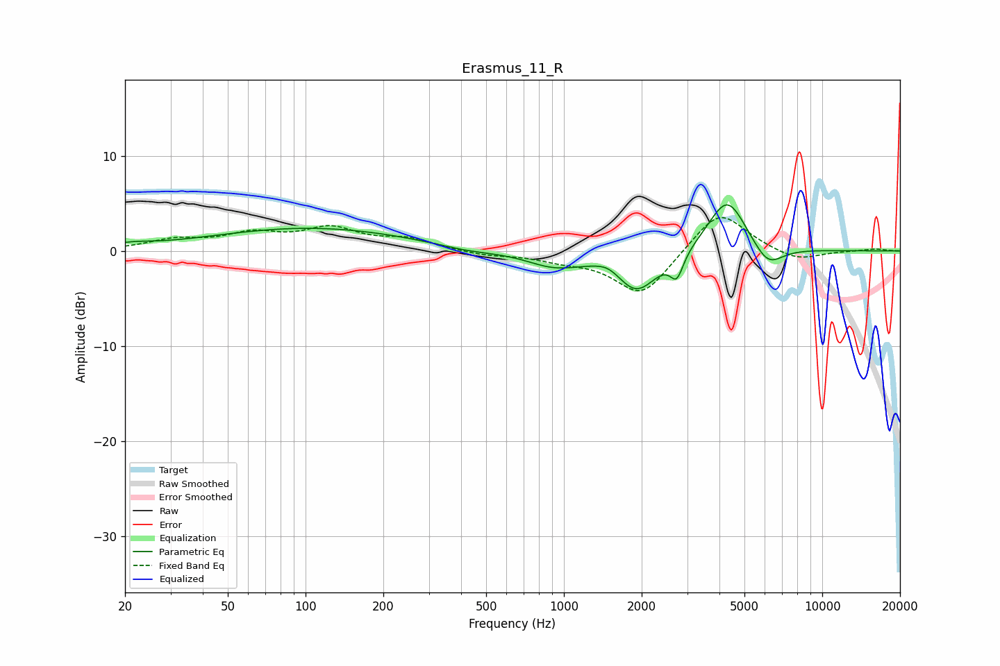

# Erasmus_11_R
See [usage instructions](https://github.com/jaakkopasanen/AutoEq#usage) for more options and info.

### Parametric EQs
Apply preamp of -4.9 dB when using parametric equalizer.

|   # | Type    |   Fc (Hz) |    Q |   Gain (dB) |
|-----|---------|-----------|------|-------------|
|   1 | Peaking |        21 | 1.89 |         0.1 |
|   2 | Peaking |        22 | 1.92 |         0.2 |
|   3 | Peaking |       105 | 0.37 |         2.4 |
|   4 | Peaking |       422 | 1.23 |        -0.5 |
|   5 | Peaking |       918 | 1.31 |        -1.5 |
|   6 | Peaking |      1486 | 2.83 |         0.8 |
|   7 | Peaking |      1913 | 1.74 |        -4.3 |
|   8 | Peaking |      2737 | 5.62 |        -2.5 |
|   9 | Peaking |      4288 | 1.88 |         5.8 |
|  10 | Peaking |      6149 | 2.37 |        -2.4 |

### Fixed Band EQs
When using fixed band (also called graphic) equalizer, apply preamp of **-3.6 dB** (if available) and set gains manually with these parameters.

|   # | Type    |   Fc (Hz) |    Q |   Gain (dB) |
|-----|---------|-----------|------|-------------|
|   1 | Peaking |        31 | 1.41 |         1   |
|   2 | Peaking |        62 | 1.41 |         1.6 |
|   3 | Peaking |       125 | 1.41 |         2.2 |
|   4 | Peaking |       250 | 1.41 |         1.1 |
|   5 | Peaking |       500 | 1.41 |        -0.4 |
|   6 | Peaking |      1000 | 1.41 |        -0.8 |
|   7 | Peaking |      2000 | 1.41 |        -4.8 |
|   8 | Peaking |      4000 | 1.41 |         4.5 |
|   9 | Peaking |      8000 | 1.41 |        -1.1 |
|  10 | Peaking |     16000 | 1.41 |         0.2 |

### Graphs

