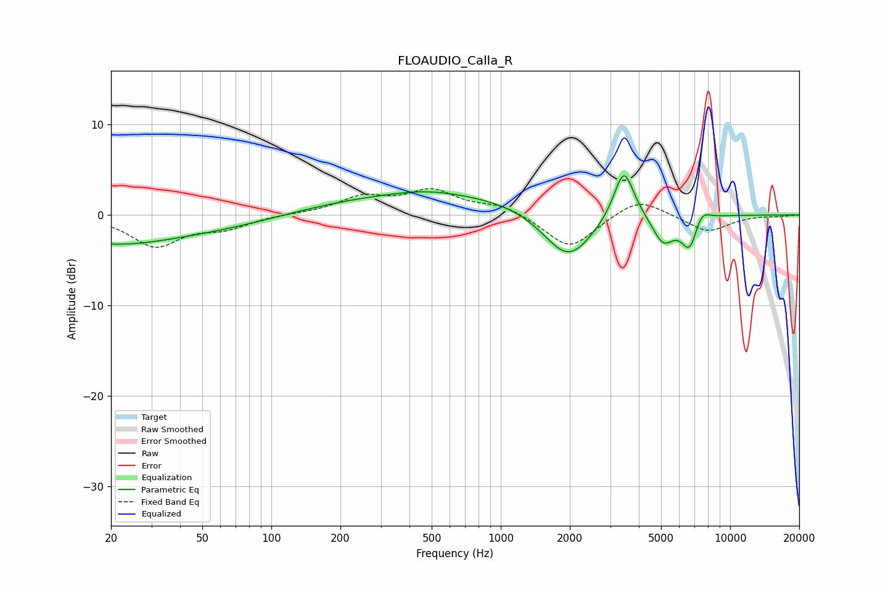

# FLOAUDIO_Calla_R
See [usage instructions](https://github.com/jaakkopasanen/AutoEq#usage) for more options and info.

### Parametric EQs
Apply preamp of -4.4 dB when using parametric equalizer.

|   # | Type    |   Fc (Hz) |    Q |   Gain (dB) |
|-----|---------|-----------|------|-------------|
|   1 | Peaking |        20 | 0.66 |        -1.4 |
|   2 | Peaking |        20 | 5.28 |        -0   |
|   3 | Peaking |        37 | 0.29 |        -2.1 |
|   4 | Peaking |       469 | 1.01 |         0.5 |
|   5 | Peaking |       593 | 0.18 |         2.5 |
|   6 | Peaking |      1972 | 1.21 |        -6.3 |
|   7 | Peaking |      3440 | 3.23 |         5.7 |
|   8 | Peaking |      5105 | 2.88 |        -3.2 |
|   9 | Peaking |      6672 | 3.67 |        -3.8 |
|  10 | Peaking |      7459 | 3.75 |         1.7 |

### Fixed Band EQs
When using fixed band (also called graphic) equalizer, apply preamp of **-3.0 dB** (if available) and set gains manually with these parameters.

|   # | Type    |   Fc (Hz) |    Q |   Gain (dB) |
|-----|---------|-----------|------|-------------|
|   1 | Peaking |        31 | 1.41 |        -3.4 |
|   2 | Peaking |        62 | 1.41 |        -1.3 |
|   3 | Peaking |       125 | 1.41 |         0.1 |
|   4 | Peaking |       250 | 1.41 |         1.8 |
|   5 | Peaking |       500 | 1.41 |         2.5 |
|   6 | Peaking |      1000 | 1.41 |         1.1 |
|   7 | Peaking |      2000 | 1.41 |        -3.8 |
|   8 | Peaking |      4000 | 1.41 |         2   |
|   9 | Peaking |      8000 | 1.41 |        -1.9 |
|  10 | Peaking |     16000 | 1.41 |        -0.1 |

### Graphs

