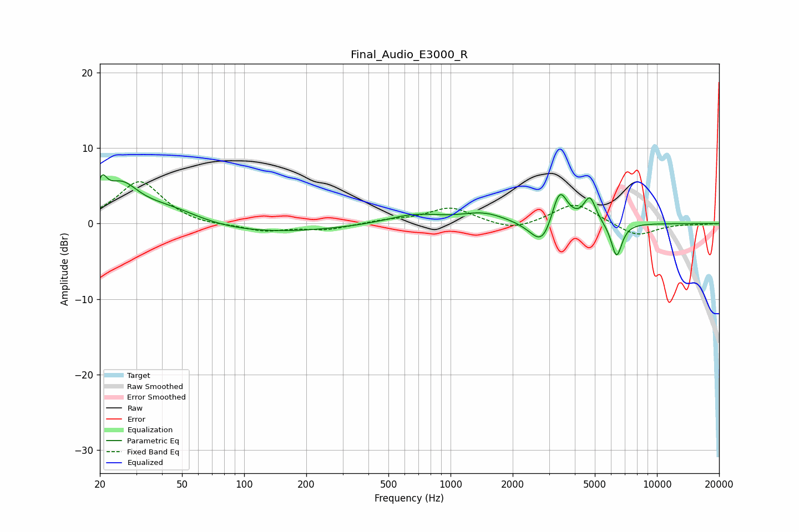

# Final_Audio_E3000_R
See [usage instructions](https://github.com/jaakkopasanen/AutoEq#usage) for more options and info.

### Parametric EQs
Apply preamp of -6.6 dB when using parametric equalizer.

|   # | Type    |   Fc (Hz) |    Q |   Gain (dB) |
|-----|---------|-----------|------|-------------|
|   1 | Peaking |        20 | 5.86 |         3.2 |
|   2 | Peaking |        25 | 1.6  |         5.1 |
|   3 | Peaking |        42 | 0.82 |         2.9 |
|   4 | Peaking |        57 | 0.21 |        -1.7 |
|   5 | Peaking |       667 | 1.07 |         1.2 |
|   6 | Peaking |      1450 | 1.31 |         1.3 |
|   7 | Peaking |      2795 | 2.47 |        -3.8 |
|   8 | Peaking |      3368 | 3.57 |         5.3 |
|   9 | Peaking |      4730 | 4.74 |         3.4 |
|  10 | Peaking |      6373 | 5.25 |        -4.6 |

### Fixed Band EQs
When using fixed band (also called graphic) equalizer, apply preamp of **-5.6 dB** (if available) and set gains manually with these parameters.

|   # | Type    |   Fc (Hz) |    Q |   Gain (dB) |
|-----|---------|-----------|------|-------------|
|   1 | Peaking |        31 | 1.41 |         5.6 |
|   2 | Peaking |        62 | 1.41 |        -0.4 |
|   3 | Peaking |       125 | 1.41 |        -1   |
|   4 | Peaking |       250 | 1.41 |        -0.8 |
|   5 | Peaking |       500 | 1.41 |         0.4 |
|   6 | Peaking |      1000 | 1.41 |         2.1 |
|   7 | Peaking |      2000 | 1.41 |        -1.1 |
|   8 | Peaking |      4000 | 1.41 |         2.8 |
|   9 | Peaking |      8000 | 1.41 |        -1.7 |
|  10 | Peaking |     16000 | 1.41 |        -0.1 |

### Graphs

