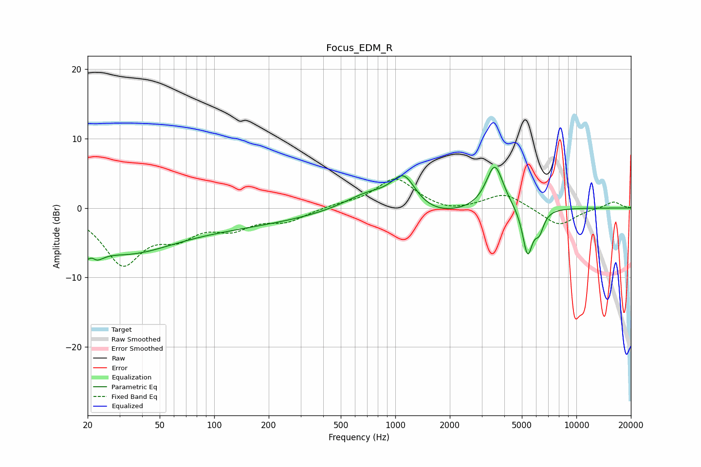

# Focus_EDM_R
See [usage instructions](https://github.com/jaakkopasanen/AutoEq#usage) for more options and info.

### Parametric EQs
Apply preamp of -6.0 dB when using parametric equalizer.

|   # | Type    |   Fc (Hz) |    Q |   Gain (dB) |
|-----|---------|-----------|------|-------------|
|   1 | Peaking |        21 | 3.48 |        -5.6 |
|   2 | Peaking |        21 | 5.78 |         3.2 |
|   3 | Peaking |        32 | 0.55 |        -5.4 |
|   4 | Peaking |       127 | 0.34 |        -2.2 |
|   5 | Peaking |       714 | 1.04 |         2.5 |
|   6 | Peaking |      1115 | 2.06 |         4.9 |
|   7 | Peaking |      1511 | 0.72 |        -1.7 |
|   8 | Peaking |      3542 | 2.94 |         6.6 |
|   9 | Peaking |      5377 | 4.96 |        -6.8 |
|  10 | Peaking |      6243 | 5.57 |        -2.6 |

### Fixed Band EQs
When using fixed band (also called graphic) equalizer, apply preamp of **-4.3 dB** (if available) and set gains manually with these parameters.

|   # | Type    |   Fc (Hz) |    Q |   Gain (dB) |
|-----|---------|-----------|------|-------------|
|   1 | Peaking |        31 | 1.41 |        -7.7 |
|   2 | Peaking |        62 | 1.41 |        -3.2 |
|   3 | Peaking |       125 | 1.41 |        -2.5 |
|   4 | Peaking |       250 | 1.41 |        -1.7 |
|   5 | Peaking |       500 | 1.41 |         0.4 |
|   6 | Peaking |      1000 | 1.41 |         4.3 |
|   7 | Peaking |      2000 | 1.41 |        -0.8 |
|   8 | Peaking |      4000 | 1.41 |         2.2 |
|   9 | Peaking |      8000 | 1.41 |        -2.6 |
|  10 | Peaking |     16000 | 1.41 |         1   |

### Graphs

