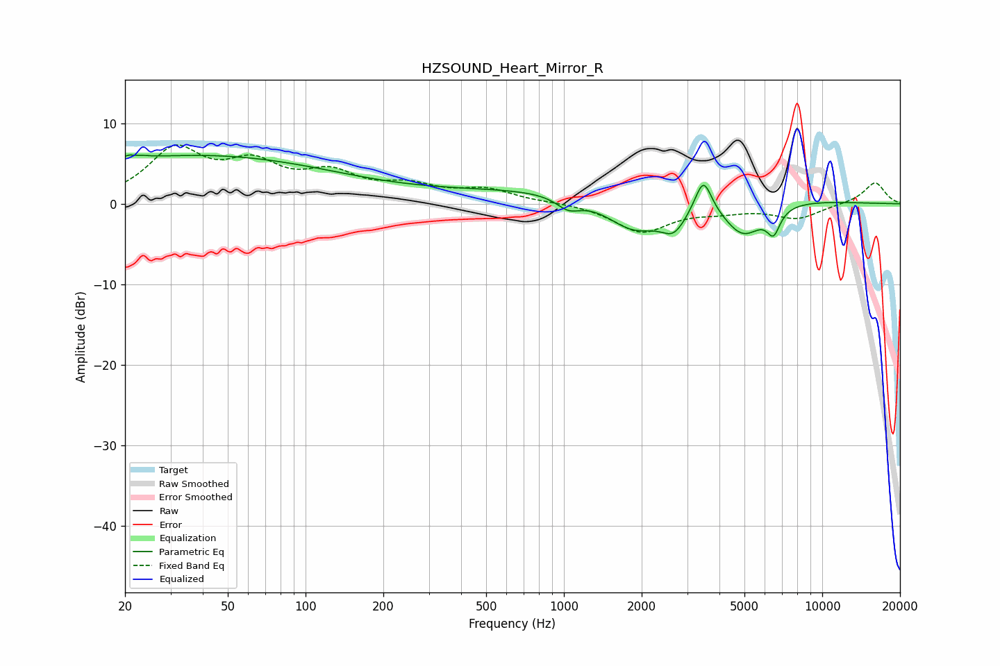

# HZSOUND_Heart_Mirror_R
See [usage instructions](https://github.com/jaakkopasanen/AutoEq#usage) for more options and info.

### Parametric EQs
Apply preamp of -6.2 dB when using parametric equalizer.

|   # | Type    |   Fc (Hz) |    Q |   Gain (dB) |
|-----|---------|-----------|------|-------------|
|   1 | Peaking |        22 | 5.25 |         3.4 |
|   2 | Peaking |        22 | 5.91 |        -2.8 |
|   3 | Peaking |        38 | 0.25 |         6   |
|   4 | Peaking |      1042 | 3.02 |        -1.5 |
|   5 | Peaking |      1573 | 0.19 |         2.1 |
|   6 | Peaking |      1872 | 1.25 |        -4.5 |
|   7 | Peaking |      2668 | 2.8  |        -3   |
|   8 | Peaking |      3467 | 4.43 |         4.3 |
|   9 | Peaking |      4938 | 1.76 |        -4.7 |
|  10 | Peaking |      6480 | 5.43 |        -2.9 |

### Fixed Band EQs
When using fixed band (also called graphic) equalizer, apply preamp of **-7.4 dB** (if available) and set gains manually with these parameters.

|   # | Type    |   Fc (Hz) |    Q |   Gain (dB) |
|-----|---------|-----------|------|-------------|
|   1 | Peaking |        31 | 1.41 |         6.4 |
|   2 | Peaking |        62 | 1.41 |         4.2 |
|   3 | Peaking |       125 | 1.41 |         3.2 |
|   4 | Peaking |       250 | 1.41 |         1.9 |
|   5 | Peaking |       500 | 1.41 |         1.6 |
|   6 | Peaking |      1000 | 1.41 |         0.1 |
|   7 | Peaking |      2000 | 1.41 |        -3.5 |
|   8 | Peaking |      4000 | 1.41 |        -0.7 |
|   9 | Peaking |      8000 | 1.41 |        -1.8 |
|  10 | Peaking |     16000 | 1.41 |         2.7 |

### Graphs

