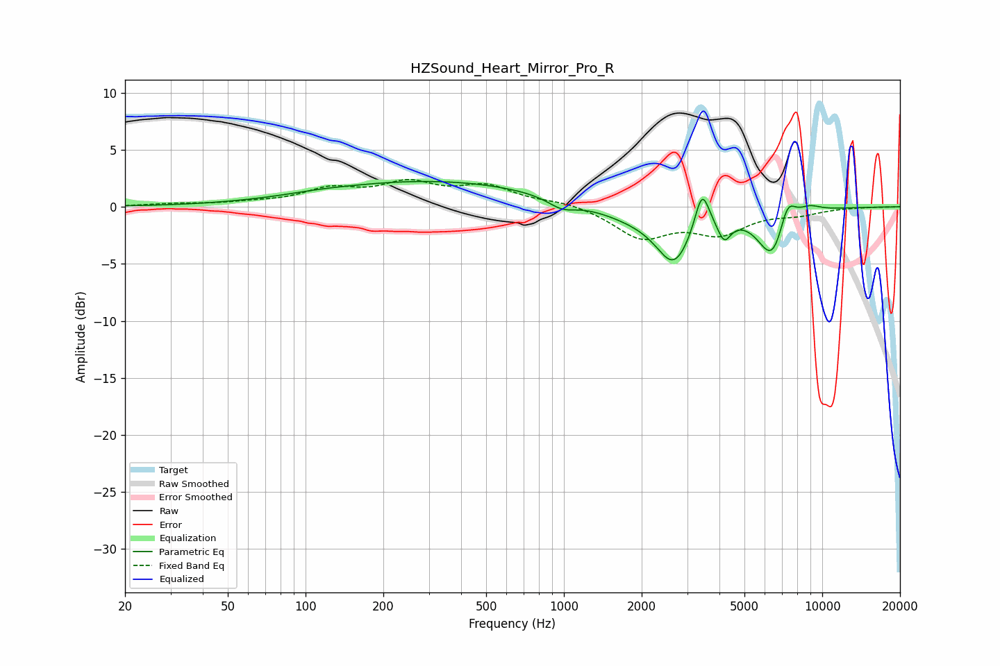

# HZSound_Heart_Mirror_Pro_R
See [usage instructions](https://github.com/jaakkopasanen/AutoEq#usage) for more options and info.

### Parametric EQs
Apply preamp of -2.3 dB when using parametric equalizer.

|   # | Type    |   Fc (Hz) |    Q |   Gain (dB) |
|-----|---------|-----------|------|-------------|
|   1 | Peaking |       111 | 1.28 |         0.1 |
|   2 | Peaking |       312 | 0.32 |         2.3 |
|   3 | Peaking |       983 | 2.57 |        -0.9 |
|   4 | Peaking |      1883 | 0.94 |        -1   |
|   5 | Peaking |      2668 | 2.09 |        -4.4 |
|   6 | Peaking |      3427 | 5.11 |         3.5 |
|   7 | Peaking |      4175 | 5.47 |        -1.9 |
|   8 | Peaking |      6443 | 2.37 |        -4.6 |
|   9 | Peaking |      7320 | 4.08 |         2.7 |
|  10 | Peaking |      8893 | 2.79 |         0.7 |

### Fixed Band EQs
When using fixed band (also called graphic) equalizer, apply preamp of **-2.5 dB** (if available) and set gains manually with these parameters.

|   # | Type    |   Fc (Hz) |    Q |   Gain (dB) |
|-----|---------|-----------|------|-------------|
|   1 | Peaking |        31 | 1.41 |         0.2 |
|   2 | Peaking |        62 | 1.41 |         0.3 |
|   3 | Peaking |       125 | 1.41 |         1.4 |
|   4 | Peaking |       250 | 1.41 |         1.8 |
|   5 | Peaking |       500 | 1.41 |         1.6 |
|   6 | Peaking |      1000 | 1.41 |         0.4 |
|   7 | Peaking |      2000 | 1.41 |        -2.6 |
|   8 | Peaking |      4000 | 1.41 |        -2.1 |
|   9 | Peaking |      8000 | 1.41 |        -0.5 |
|  10 | Peaking |     16000 | 1.41 |         0   |

### Graphs

