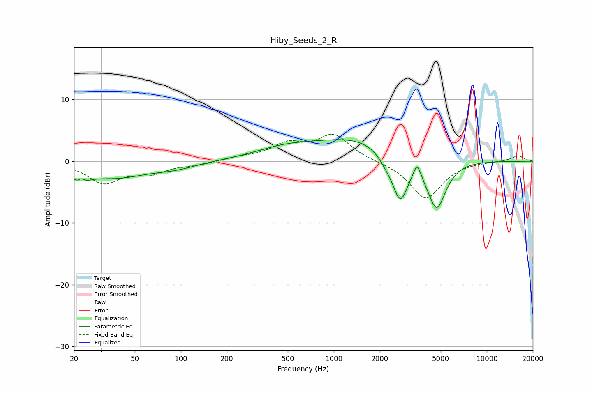

# Hiby_Seeds_2_R
See [usage instructions](https://github.com/jaakkopasanen/AutoEq#usage) for more options and info.

### Parametric EQs
Apply preamp of -3.6 dB when using parametric equalizer.

|   # | Type    |   Fc (Hz) |    Q |   Gain (dB) |
|-----|---------|-----------|------|-------------|
|   1 | Peaking |        22 | 3.49 |        -2.9 |
|   2 | Peaking |        22 | 5.9  |         1.9 |
|   3 | Peaking |        37 | 0.63 |        -2.6 |
|   4 | Peaking |        93 | 1.12 |        -0.7 |
|   5 | Peaking |       466 | 0.72 |         1.5 |
|   6 | Peaking |      1492 | 0.46 |         3.7 |
|   7 | Peaking |      2185 | 2.76 |        -1.2 |
|   8 | Peaking |      2717 | 2.68 |        -7.5 |
|   9 | Peaking |      3504 | 6    |         2.5 |
|  10 | Peaking |      4700 | 2.23 |        -8.2 |

### Fixed Band EQs
When using fixed band (also called graphic) equalizer, apply preamp of **-4.5 dB** (if available) and set gains manually with these parameters.

|   # | Type    |   Fc (Hz) |    Q |   Gain (dB) |
|-----|---------|-----------|------|-------------|
|   1 | Peaking |        31 | 1.41 |        -3.4 |
|   2 | Peaking |        62 | 1.41 |        -1.7 |
|   3 | Peaking |       125 | 1.41 |        -0.5 |
|   4 | Peaking |       250 | 1.41 |         0.5 |
|   5 | Peaking |       500 | 1.41 |         2.5 |
|   6 | Peaking |      1000 | 1.41 |         4.1 |
|   7 | Peaking |      2000 | 1.41 |        -0   |
|   8 | Peaking |      4000 | 1.41 |        -6.1 |
|   9 | Peaking |      8000 | 1.41 |         0   |
|  10 | Peaking |     16000 | 1.41 |         0.9 |

### Graphs

