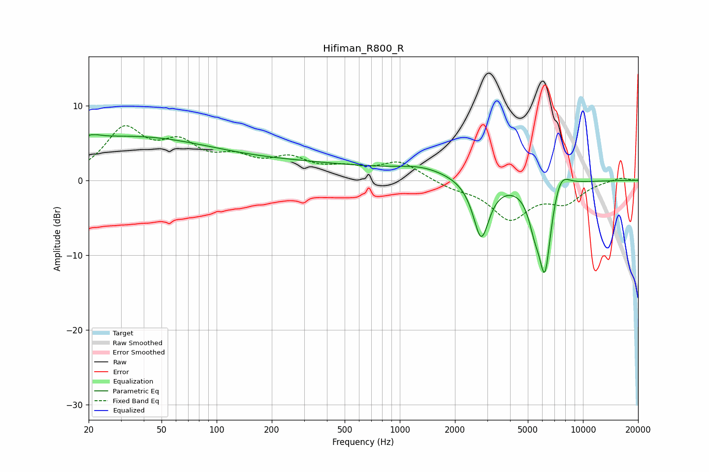

# Hifiman_R800_R
See [usage instructions](https://github.com/jaakkopasanen/AutoEq#usage) for more options and info.

### Parametric EQs
Apply preamp of -6.2 dB when using parametric equalizer.

|   # | Type    |   Fc (Hz) |    Q |   Gain (dB) |
|-----|---------|-----------|------|-------------|
|   1 | Peaking |        21 | 5.28 |         3.4 |
|   2 | Peaking |        21 | 5.64 |        -3   |
|   3 | Peaking |        23 | 0.24 |         5.2 |
|   4 | Peaking |       114 | 0.25 |         1.4 |
|   5 | Peaking |       611 | 0.26 |         1.3 |
|   6 | Peaking |      1318 | 1.14 |         0.8 |
|   7 | Peaking |      2783 | 3.19 |        -8   |
|   8 | Peaking |      5440 | 4.21 |        -3.1 |
|   9 | Peaking |      6197 | 3.75 |       -12.3 |
|  10 | Peaking |      7479 | 2.75 |         3.1 |

### Fixed Band EQs
When using fixed band (also called graphic) equalizer, apply preamp of **-7.4 dB** (if available) and set gains manually with these parameters.

|   # | Type    |   Fc (Hz) |    Q |   Gain (dB) |
|-----|---------|-----------|------|-------------|
|   1 | Peaking |        31 | 1.41 |         6.4 |
|   2 | Peaking |        62 | 1.41 |         4   |
|   3 | Peaking |       125 | 1.41 |         2.3 |
|   4 | Peaking |       250 | 1.41 |         2.5 |
|   5 | Peaking |       500 | 1.41 |         1.3 |
|   6 | Peaking |      1000 | 1.41 |         2.4 |
|   7 | Peaking |      2000 | 1.41 |        -0.9 |
|   8 | Peaking |      4000 | 1.41 |        -4.9 |
|   9 | Peaking |      8000 | 1.41 |        -2.6 |
|  10 | Peaking |     16000 | 1.41 |         0.4 |

### Graphs

