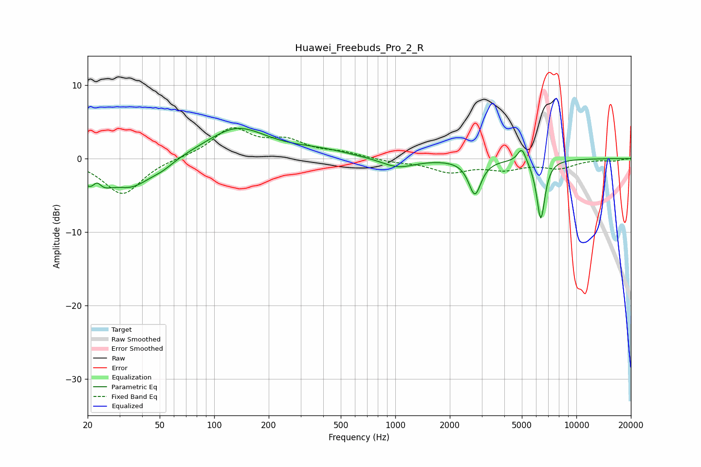

# Huawei_Freebuds_Pro_2_R
See [usage instructions](https://github.com/jaakkopasanen/AutoEq#usage) for more options and info.

### Parametric EQs
Apply preamp of -4.2 dB when using parametric equalizer.

|   # | Type    |   Fc (Hz) |    Q |   Gain (dB) |
|-----|---------|-----------|------|-------------|
|   1 | Peaking |        22 | 2.13 |        -4.1 |
|   2 | Peaking |        23 | 5.54 |         2   |
|   3 | Peaking |        35 | 1.28 |        -3.4 |
|   4 | Peaking |        52 | 2.22 |        -0.8 |
|   5 | Peaking |       133 | 0.85 |         4.1 |
|   6 | Peaking |       381 | 0.83 |         0.9 |
|   7 | Peaking |      1034 | 1.5  |        -1.3 |
|   8 | Peaking |      2751 | 4.16 |        -4.7 |
|   9 | Peaking |      5000 | 5.93 |         2.1 |
|  10 | Peaking |      6362 | 5.94 |        -8.2 |

### Fixed Band EQs
When using fixed band (also called graphic) equalizer, apply preamp of **-4.3 dB** (if available) and set gains manually with these parameters.

|   # | Type    |   Fc (Hz) |    Q |   Gain (dB) |
|-----|---------|-----------|------|-------------|
|   1 | Peaking |        31 | 1.41 |        -4.9 |
|   2 | Peaking |        62 | 1.41 |         0.1 |
|   3 | Peaking |       125 | 1.41 |         3.9 |
|   4 | Peaking |       250 | 1.41 |         2.1 |
|   5 | Peaking |       500 | 1.41 |         0.7 |
|   6 | Peaking |      1000 | 1.41 |        -0.4 |
|   7 | Peaking |      2000 | 1.41 |        -1.7 |
|   8 | Peaking |      4000 | 1.41 |        -1.2 |
|   9 | Peaking |      8000 | 1.41 |        -1.2 |
|  10 | Peaking |     16000 | 1.41 |        -0.3 |

### Graphs

