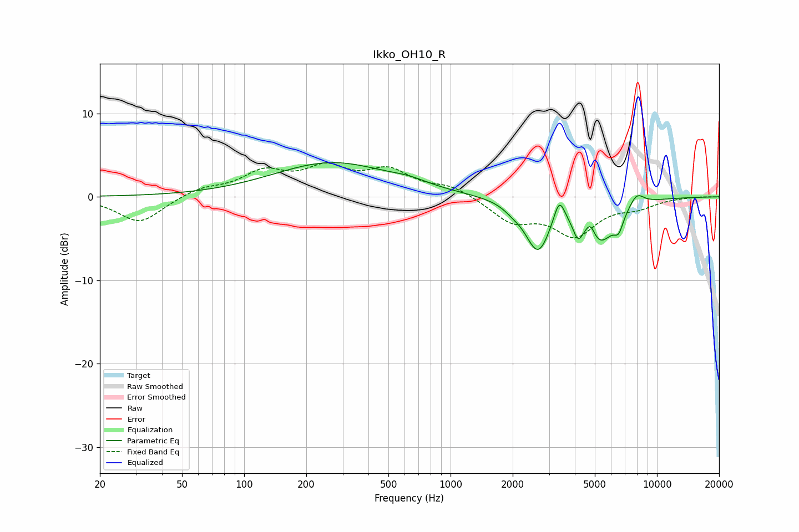

# Ikko_OH10_R
See [usage instructions](https://github.com/jaakkopasanen/AutoEq#usage) for more options and info.

### Parametric EQs
Apply preamp of -4.2 dB when using parametric equalizer.

|   # | Type    |   Fc (Hz) |    Q |   Gain (dB) |
|-----|---------|-----------|------|-------------|
|   1 | Peaking |       266 | 0.5  |         4.1 |
|   2 | Peaking |       635 | 1.61 |         0.5 |
|   3 | Peaking |      2005 | 3.15 |        -0.5 |
|   4 | Peaking |      2649 | 2.32 |        -6.1 |
|   5 | Peaking |      3362 | 5.16 |         3   |
|   6 | Peaking |      4141 | 5.99 |        -2.1 |
|   7 | Peaking |      4753 | 6    |         1.9 |
|   8 | Peaking |      5241 | 1.78 |        -5.2 |
|   9 | Peaking |      6526 | 5.99 |        -1.8 |
|  10 | Peaking |      7976 | 3.65 |         1.6 |

### Fixed Band EQs
When using fixed band (also called graphic) equalizer, apply preamp of **-4.1 dB** (if available) and set gains manually with these parameters.

|   # | Type    |   Fc (Hz) |    Q |   Gain (dB) |
|-----|---------|-----------|------|-------------|
|   1 | Peaking |        31 | 1.41 |        -3.1 |
|   2 | Peaking |        62 | 1.41 |         1   |
|   3 | Peaking |       125 | 1.41 |         2.7 |
|   4 | Peaking |       250 | 1.41 |         3   |
|   5 | Peaking |       500 | 1.41 |         2.8 |
|   6 | Peaking |      1000 | 1.41 |         1.2 |
|   7 | Peaking |      2000 | 1.41 |        -2.8 |
|   8 | Peaking |      4000 | 1.41 |        -4.3 |
|   9 | Peaking |      8000 | 1.41 |        -1   |
|  10 | Peaking |     16000 | 1.41 |         0.1 |

### Graphs

