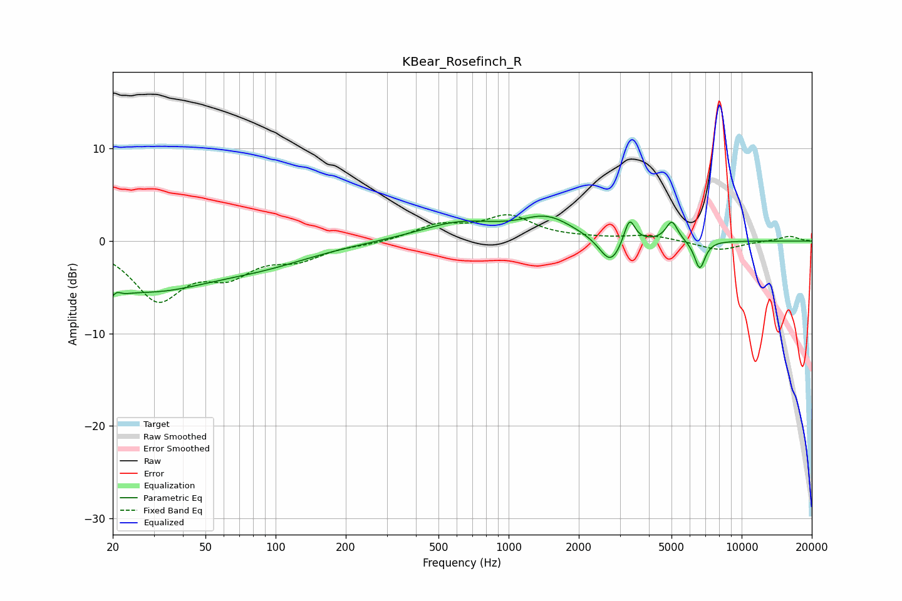

# KBear_Rosefinch_R
See [usage instructions](https://github.com/jaakkopasanen/AutoEq#usage) for more options and info.

### Parametric EQs
Apply preamp of -2.8 dB when using parametric equalizer.

|   # | Type    |   Fc (Hz) |    Q |   Gain (dB) |
|-----|---------|-----------|------|-------------|
|   1 | Peaking |        20 | 4.14 |        -4.7 |
|   2 | Peaking |        20 | 5.51 |         3.5 |
|   3 | Peaking |        28 | 0.51 |        -4.9 |
|   4 | Peaking |        90 | 0.62 |        -1.6 |
|   5 | Peaking |       616 | 0.82 |         1.9 |
|   6 | Peaking |      1467 | 1.26 |         2.3 |
|   7 | Peaking |      2737 | 2.99 |        -3   |
|   8 | Peaking |      3300 | 6    |         2.8 |
|   9 | Peaking |      5019 | 5.55 |         2.2 |
|  10 | Peaking |      6609 | 6    |        -3.1 |

### Fixed Band EQs
When using fixed band (also called graphic) equalizer, apply preamp of **-2.9 dB** (if available) and set gains manually with these parameters.

|   # | Type    |   Fc (Hz) |    Q |   Gain (dB) |
|-----|---------|-----------|------|-------------|
|   1 | Peaking |        31 | 1.41 |        -6   |
|   2 | Peaking |        62 | 1.41 |        -3   |
|   3 | Peaking |       125 | 1.41 |        -1.7 |
|   4 | Peaking |       250 | 1.41 |        -0.3 |
|   5 | Peaking |       500 | 1.41 |         1.6 |
|   6 | Peaking |      1000 | 1.41 |         2.5 |
|   7 | Peaking |      2000 | 1.41 |         0.2 |
|   8 | Peaking |      4000 | 1.41 |         0.6 |
|   9 | Peaking |      8000 | 1.41 |        -1   |
|  10 | Peaking |     16000 | 1.41 |         0.5 |

### Graphs

