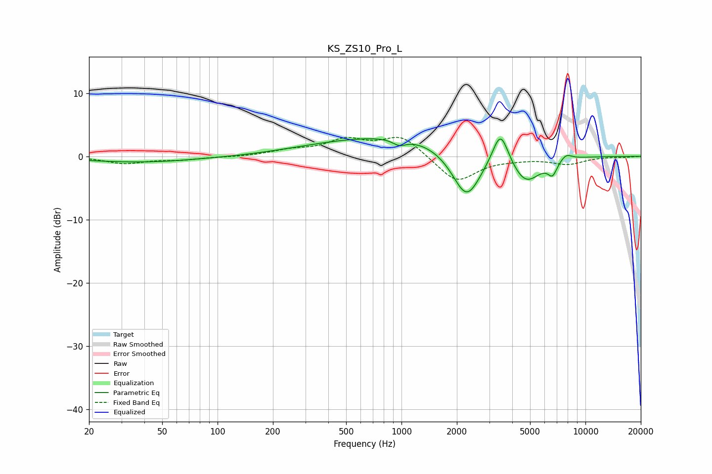

# KS_ZS10_Pro_L
See [usage instructions](https://github.com/jaakkopasanen/AutoEq#usage) for more options and info.

### Parametric EQs
Apply preamp of -2.9 dB when using parametric equalizer.

|   # | Type    |   Fc (Hz) |    Q |   Gain (dB) |
|-----|---------|-----------|------|-------------|
|   1 | Peaking |        39 | 0.43 |        -0.9 |
|   2 | Peaking |        83 | 1.16 |         0.1 |
|   3 | Peaking |       377 | 0.55 |         0.9 |
|   4 | Peaking |       973 | 3.81 |        -1   |
|   5 | Peaking |      1219 | 0.39 |         3.3 |
|   6 | Peaking |      2257 | 1.7  |        -8.4 |
|   7 | Peaking |      3453 | 3.24 |         5.6 |
|   8 | Peaking |      4732 | 1.71 |        -4.5 |
|   9 | Peaking |      6623 | 5.42 |        -2.1 |
|  10 | Peaking |      7843 | 4.07 |         1   |

### Fixed Band EQs
When using fixed band (also called graphic) equalizer, apply preamp of **-3.1 dB** (if available) and set gains manually with these parameters.

|   # | Type    |   Fc (Hz) |    Q |   Gain (dB) |
|-----|---------|-----------|------|-------------|
|   1 | Peaking |        31 | 1.41 |        -1.1 |
|   2 | Peaking |        62 | 1.41 |        -0.5 |
|   3 | Peaking |       125 | 1.41 |        -0.1 |
|   4 | Peaking |       250 | 1.41 |         0.8 |
|   5 | Peaking |       500 | 1.41 |         2.4 |
|   6 | Peaking |      1000 | 1.41 |         3.2 |
|   7 | Peaking |      2000 | 1.41 |        -4.2 |
|   8 | Peaking |      4000 | 1.41 |        -0.3 |
|   9 | Peaking |      8000 | 1.41 |        -1.2 |
|  10 | Peaking |     16000 | 1.41 |        -0.1 |

### Graphs

