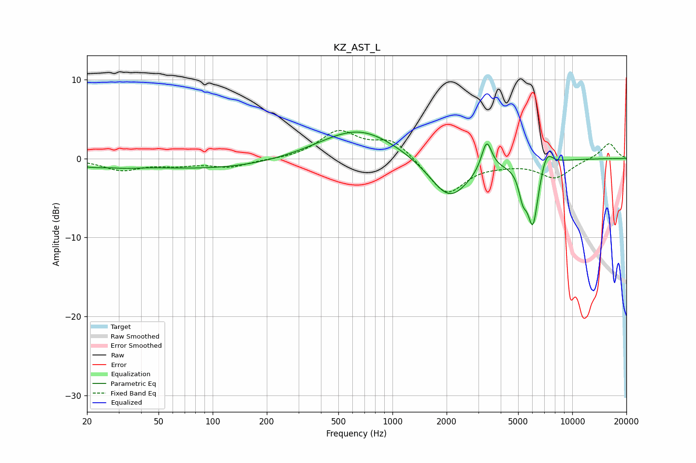

# KZ_AST_L
See [usage instructions](https://github.com/jaakkopasanen/AutoEq#usage) for more options and info.

### Parametric EQs
Apply preamp of -3.4 dB when using parametric equalizer.

|   # | Type    |   Fc (Hz) |    Q |   Gain (dB) |
|-----|---------|-----------|------|-------------|
|   1 | Peaking |        21 | 1.41 |        -0.6 |
|   2 | Peaking |        33 | 1.57 |        -0.3 |
|   3 | Peaking |        99 | 0.34 |        -1.3 |
|   4 | Peaking |       630 | 0.62 |         3.3 |
|   5 | Peaking |       691 | 0.91 |         0.6 |
|   6 | Peaking |      2076 | 1.26 |        -5.3 |
|   7 | Peaking |      3342 | 4.96 |         3.9 |
|   8 | Peaking |      5306 | 6    |        -2.9 |
|   9 | Peaking |      6040 | 4.5  |        -7.9 |
|  10 | Peaking |      7199 | 4.18 |         2.2 |

### Fixed Band EQs
When using fixed band (also called graphic) equalizer, apply preamp of **-3.6 dB** (if available) and set gains manually with these parameters.

|   # | Type    |   Fc (Hz) |    Q |   Gain (dB) |
|-----|---------|-----------|------|-------------|
|   1 | Peaking |        31 | 1.41 |        -1.4 |
|   2 | Peaking |        62 | 1.41 |        -0.7 |
|   3 | Peaking |       125 | 1.41 |        -1   |
|   4 | Peaking |       250 | 1.41 |        -0.1 |
|   5 | Peaking |       500 | 1.41 |         3.3 |
|   6 | Peaking |      1000 | 1.41 |         2.4 |
|   7 | Peaking |      2000 | 1.41 |        -4.6 |
|   8 | Peaking |      4000 | 1.41 |        -0.4 |
|   9 | Peaking |      8000 | 1.41 |        -2.4 |
|  10 | Peaking |     16000 | 1.41 |         2   |

### Graphs

