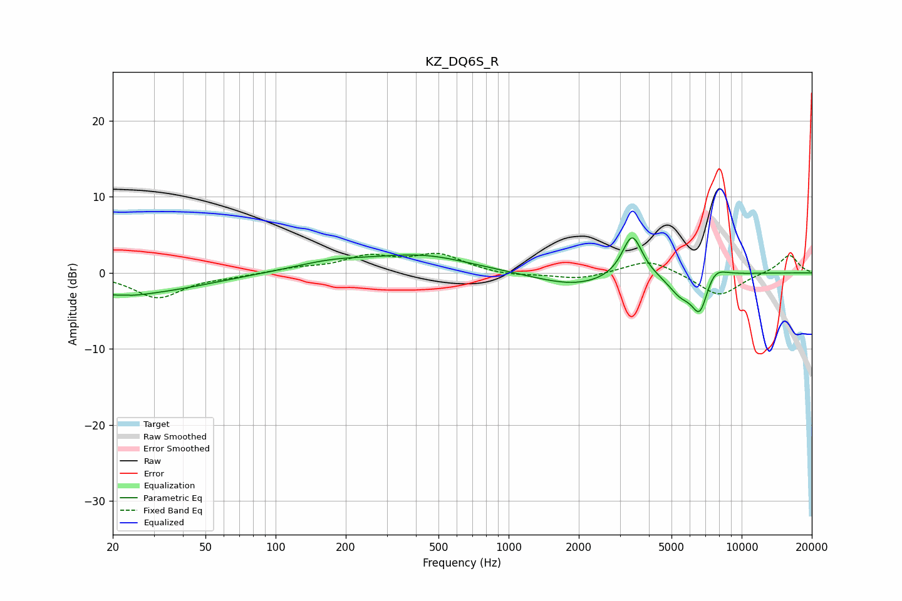

# KZ_DQ6S_R
See [usage instructions](https://github.com/jaakkopasanen/AutoEq#usage) for more options and info.

### Parametric EQs
Apply preamp of -4.7 dB when using parametric equalizer.

|   # | Type    |   Fc (Hz) |    Q |   Gain (dB) |
|-----|---------|-----------|------|-------------|
|   1 | Peaking |        20 | 0.91 |        -2.2 |
|   2 | Peaking |        22 | 5.16 |         0.1 |
|   3 | Peaking |        37 | 0.65 |        -1.4 |
|   4 | Peaking |       176 | 0.83 |         1.2 |
|   5 | Peaking |       430 | 0.68 |         2.1 |
|   6 | Peaking |      1934 | 0.83 |        -1.8 |
|   7 | Peaking |      3391 | 3.24 |         5.8 |
|   8 | Peaking |      5477 | 2.55 |        -2.5 |
|   9 | Peaking |      6626 | 3.76 |        -5   |
|  10 | Peaking |      7565 | 2.71 |         1.9 |

### Fixed Band EQs
When using fixed band (also called graphic) equalizer, apply preamp of **-2.7 dB** (if available) and set gains manually with these parameters.

|   # | Type    |   Fc (Hz) |    Q |   Gain (dB) |
|-----|---------|-----------|------|-------------|
|   1 | Peaking |        31 | 1.41 |        -3.3 |
|   2 | Peaking |        62 | 1.41 |        -0.4 |
|   3 | Peaking |       125 | 1.41 |         0.5 |
|   4 | Peaking |       250 | 1.41 |         2   |
|   5 | Peaking |       500 | 1.41 |         2.3 |
|   6 | Peaking |      1000 | 1.41 |        -0.4 |
|   7 | Peaking |      2000 | 1.41 |        -0.9 |
|   8 | Peaking |      4000 | 1.41 |         1.9 |
|   9 | Peaking |      8000 | 1.41 |        -3.1 |
|  10 | Peaking |     16000 | 1.41 |         2.4 |

### Graphs

