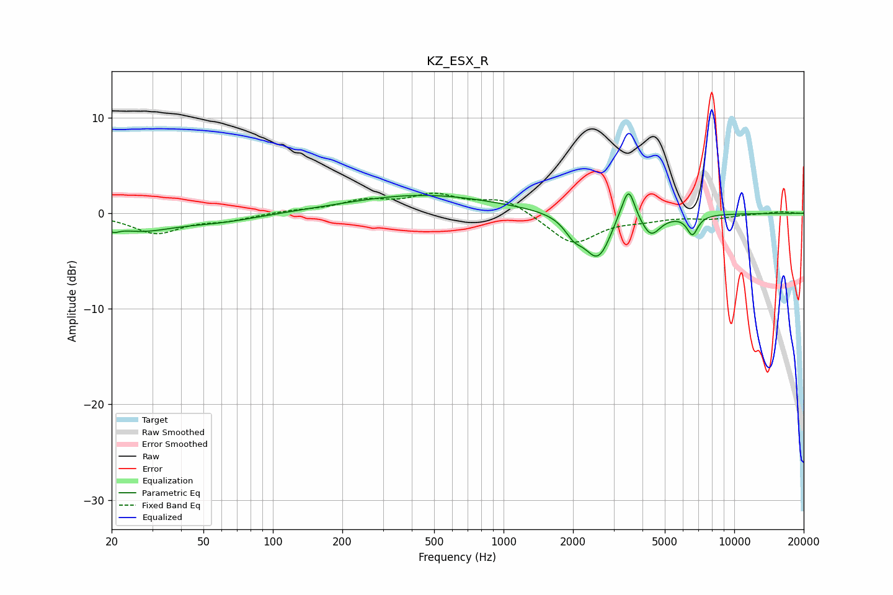

# KZ_ESX_R
See [usage instructions](https://github.com/jaakkopasanen/AutoEq#usage) for more options and info.

### Parametric EQs
Apply preamp of -2.1 dB when using parametric equalizer.

|   # | Type    |   Fc (Hz) |    Q |   Gain (dB) |
|-----|---------|-----------|------|-------------|
|   1 | Peaking |        20 | 5.8  |        -0.6 |
|   2 | Peaking |        26 | 1.01 |        -1.6 |
|   3 | Peaking |        58 | 0.78 |        -0.8 |
|   4 | Peaking |       446 | 0.44 |         1.9 |
|   5 | Peaking |      2016 | 3.55 |        -1.5 |
|   6 | Peaking |      2566 | 2.4  |        -4.7 |
|   7 | Peaking |      3173 | 3.7  |         0.8 |
|   8 | Peaking |      3488 | 5.26 |         3.4 |
|   9 | Peaking |      4355 | 3.53 |        -2.1 |
|  10 | Peaking |      6589 | 5.87 |        -2   |

### Fixed Band EQs
When using fixed band (also called graphic) equalizer, apply preamp of **-2.2 dB** (if available) and set gains manually with these parameters.

|   # | Type    |   Fc (Hz) |    Q |   Gain (dB) |
|-----|---------|-----------|------|-------------|
|   1 | Peaking |        31 | 1.41 |        -2   |
|   2 | Peaking |        62 | 1.41 |        -0.6 |
|   3 | Peaking |       125 | 1.41 |         0.3 |
|   4 | Peaking |       250 | 1.41 |         1.2 |
|   5 | Peaking |       500 | 1.41 |         1.7 |
|   6 | Peaking |      1000 | 1.41 |         1.5 |
|   7 | Peaking |      2000 | 1.41 |        -3.2 |
|   8 | Peaking |      4000 | 1.41 |        -0.5 |
|   9 | Peaking |      8000 | 1.41 |        -0.5 |
|  10 | Peaking |     16000 | 1.41 |         0.2 |

### Graphs

